# Reinforcement Learning

[Python3 面向对象 | 菜鸟教程](https://www.runoob.com/python3/python3-class.html)

[蘑菇书EasyRL](https://datawhalechina.github.io/easy-rl/#/)

[动手学强化学习](https://hrl.boyuai.com/)

## Chapter 1 Intro

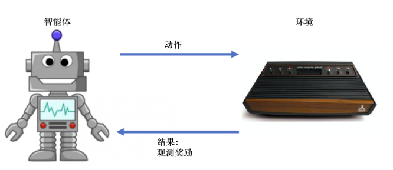


1.1奖励

由环境给的一种标量的反馈信号（scalar feedback signal），这种信号可显示智能体在某一步采取某个策略的表现如何。强化学习的目的就是最大化智能体可以获得的奖励，智能体在环境里面存在的目 的就是最大化它的期望的累积奖励（expected cumulative reward）。


1.2 智能体组成部分

- **策略（policy）**：将输入的状态变成可能采取的动作的概率，通常采用随机策略，在学习时可以通过引入一定的随机性来更好地探索环境。

**随机性策略（π函数）**：$\pi(a|s)=p\left(a_{t}=a|s_{t}=s\right)$输入状态s，输出智能体所有动作得概率。

**确定性策略**： 智能体直接采取最有可能的动作，$a^*=\arg\max_a\pi(a\mid s)$


- **价值函数（value function）**。我们用价值函数来对当前状态进行评估。价值函数用于评估智能体进 入某个状态后，可以对后面的奖励带来多大的影响。价值函数值越大，说明智能体进入这个状态越有利。

  

- **模型（model）**。模型表示智能体对环境的状态进行理解，它决定了环境中世界的运行方式。 

  


1.3 智能体类型

* **基于价值的智能体**：显式地学习价值函数，隐式地学习它的策略。策略是其从学到的价值函数里面推算出来的（Q-learning/Sarsa）


* **基于策略的智能体**：直接学习策略，我们给它一个状态，它就会输出对应动作的概率。（Policy Gradient/PG）

  

```python
import gymnasium as gym

#创建一个env 参数包括场景类型、渲染模式
env = gym.make("LunarLander-v3", render_mode="human")
observation, info = env.reset()

#首先设置eposode_over为flase，进入训练循环
episode_over = False
while not episode_over:
    action = env.action_space.sample()  # agent policy that uses the observation and info
    observation, reward, terminated, truncated, info = env.step(action) #智能体执行动作，智能体从更新后的环境接收到新的观测以及执行动作的奖励；

    episode_over = terminated or truncated

env.close()
```


## Chapter 2 Markov decision process(MDP)

### 2.1马尔科夫过程

1、随机过程：

已知历史信息（S1, ..., St）时下一个时刻状态为St+1的概率表示成$P(S_{t+1}|S_1,\ldots,S_t)$

2、马尔科夫性质：（**状态转移**）

当且仅当某时刻的状态只取决于上一时刻的状态时$P(S_{t+1}|S_t)=P(S_{t+1}|S_1,\ldots,S_t)$

3、马尔科夫链：<S, P>

n个状态：S = {S1, S2, ... , Sn}

状态转移矩阵P：$\mathcal{P}=\begin{bmatrix}P(s_1|s_1)&\cdots&P(s_n|s_1)\\\vdots&\ddots&\vdots\\P(s_1|s_n)&\cdots&P(s_n|s_n)\end{bmatrix}$  （每一行和为1）


### 2.2马尔科夫奖励过程（MRP）

1. 马尔科夫奖励过程：

$\langle\mathcal{s},\mathcal{P},r,\gamma\rangle$

* $\mathcal{s}$是有限状态的集合。

* $\mathcal{P}$是状态转移矩阵。

* $r$是奖励函数，**某个状态$s$的奖励 $r(s)$指转移到该状态时可以获得奖励的期望**。

* $\gamma$是折扣因子 (discount factor), $\gamma$的取值范围为[0,1)。引入折扣因子的理由为远期利益具有一定不确定性，有时我们更希望能够尽快获得一些奖励，所以我们需要对远期利益打一些折扣。接近 1 的γ更关注长期的累计奖励，接近 0 的γ更考虑短期奖励。

  


#### 2. 回报：

在一个马尔可夫奖励过程中，从第t时刻状态开始，直到终止状态时，所有奖励的衰减之和称为**回报**Gt（Return）

$$G_t=r_t+\gamma r_{t+1}+\gamma^2r_{t+2}+\cdots=\sum_{k=0}^\infty\gamma^kr_{t+k}$$

其中**r_t表示在t时刻获得的奖励**

```python 
import numpy as np
np.random.seed(0)
# 定义状态转移概率矩阵P
P = [
    [0.9, 0.1, 0.0, 0.0, 0.0, 0.0],
    [0.5, 0.0, 0.5, 0.0, 0.0, 0.0],
    [0.0, 0.0, 0.0, 0.6, 0.0, 0.4],
    [0.0, 0.0, 0.0, 0.0, 0.3, 0.7],
    [0.0, 0.2, 0.3, 0.5, 0.0, 0.0],
    [0.0, 0.0, 0.0, 0.0, 0.0, 1.0],
]
P = np.array(P)

rewards = [-1, -2, -2, 10, 1, 0]  # 定义奖励函数
gamma = 0.5  # 定义折扣因子


# 给定一条序列,计算从某个索引（起始状态）开始到序列最后（终止状态）得到的回报
def compute_return(start_index, chain, gamma):
    G = 0
    for i in range(len(chain)-1, -1, len(chain)):
        G = gamma * G + rewards[chain[i] - 1] #使用reversed先算chain最后一位，每一次都会对其进行乘gamma
    return G


# 一个状态序列,s1-s2-s3-s6
chain = [1, 2, 3, 6]
start_index = 0
G = compute_return(start_index, chain, gamma)
print("根据本序列计算得到回报为：%s。" % G)
```


#### 3. 价值函数：

（1）马尔可夫奖励过程中，一个状态的期望回报（即从这个状态出发的未来累积奖励的期望）被称为这个状态的**价值**（value）。

🙌注意价值是针对某个起始状态t的!!!

（2）所有状态的价值就组成了**价值函数**（value function）**V(s)**，价值函数的输入为某个状态，输出为这个状态的价值。

$$\begin{aligned}V(s)&=\mathbb{E}[G_t|s_t=s]\\&=\mathbb{E}[r_t+\gamma r_{t+1}+\gamma^2r_{t+2}+\ldots|s_t=s]\\&=\mathbb{E}[r_t+\gamma(r_{t+1}+\gamma r_{t+2}+\ldots)|s_t=s]\\&=\mathbb{E}[r_t+\gamma G_{t+1}|s_t=s]\\&=\mathbb{E}[r_t+\gamma V(s_{t+1})|s_t=s]\end{aligned}$$

对最后一式进行分解，其中，即时奖励的期望为奖励函数的输出：$\mathbb{E}[r_t|s_t=s]=R(s)$

剩余部分$\mathbb{E}[\gamma V(s_{t+1})|s_{t}=s]$ 根据从状态s出发的转移概率可以得到；

因此等式等价为**贝尔曼方程**：

✨$V(s)=R(s)+\gamma\sum_{s^{\prime}\in S}p(s^{\prime}|s)V(s^{\prime})$

（3）矩阵形式

$$\mathcal{V}=\mathcal{R}+\gamma\mathcal{PV}\\\begin{bmatrix}V(s_1)\\V(s_2)\\\cdots\\V(s_n)\end{bmatrix}=\begin{bmatrix}r(s_1)\\r(s_2)\\\cdots\\r(s_n)\end{bmatrix}+\gamma\begin{bmatrix}P(s_1|s_1)&p(s_2|s_1)&\ldots&P(s_n|s_1)\\P(s_1|s_2)&P(s_2|s_2)&\ldots&P(s_n|s_2)\\\cdots\\P(s_1|s_n)&P(s_2|s_n)&\ldots&P(s_n|s_n)\end{bmatrix}\begin{bmatrix}V(s_1)\\V(s_2)\\\ldots\\V(s_n)\end{bmatrix}$$

解析解：$$\mathcal{V}=(I-\gamma\mathcal{P})^{-1}\mathcal{R}$$ 时间复杂度为O(n^3)

```python
def compute(P, rewards, gamma, states_num):
    ''' 利用贝尔曼方程的矩阵形式计算解析解,states_num是MRP的状态数 '''
    rewards = np.array(rewards).reshape((-1, 1))  #将rewards写成列向量形式
    value = np.dot(np.linalg.inv(np.eye(states_num, states_num) - gamma * P), rewards)
    return value


V = compute(P, rewards, gamma, 6)
print("MRP中每个状态价值分别为\n", V)
```


#### 4. 迭代算法：

（1）蒙特卡洛采样算法：(相当于对回报求均值)

当得到一个马尔可夫奖励过程后，我们可以从某个状态开始，把小船放到状态转移矩阵里面，让它“随波逐流”，这样就会产生一个轨迹。产生一个轨迹之后，就会得到一个奖励，那么直接把折扣的奖励即回报 g 算出来。算出来之后将它积累起来，得到回报Gt。 当积累了一定数量的轨迹之后，我们直接用 Gt除以轨迹数量，就会得到某个状态的价值


（2）动态规划算法：

通过**自举（bootstrapping）**的方法不停地迭代贝尔曼方程，当最后更新的状态与我们上一个状态的区别并不大的时候，更新就可以停止，我们就可以输出最新的 V′(s) 作为它当前的状态的价值。


### 2.3 马尔科夫决策过程（MDP）

1. 组成：MDP = MRP + agent's action

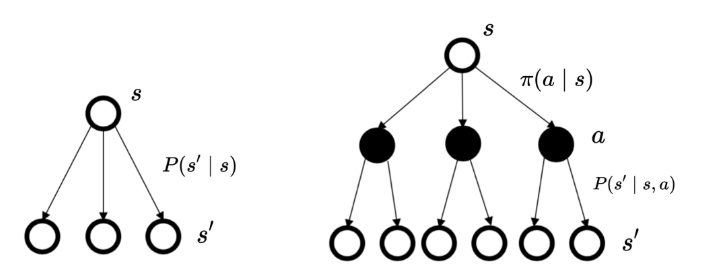

$$\langle\mathcal{s},\mathcal{a},P,r,\gamma\rangle$$

$$\begin{aligned}&\mathcal{s}\text{是状态的集合;}\\&\mathcal{a}\text{是动作的集合;}\\&\gamma\text{是折扣因子;}\\&r(s,a)\text{是奖励函数,此时奖励可以同时取决于状态}s\text{和动作}a\text{,在奖励函数只取决于状态}s\text{时,则}\\&\text{退化为}r(s)\mathrm{;}\\&P(s^{\prime}|s,a)\text{是状态转移函数,表示在状态}s\text{执行动作}a\text{之后到达状态}s^{\prime}\text{的概率。}\end{aligned}$$


#### 2. 策略：

（1）**状态、动作概率**：

**策略**（在某个状态可能采取某个行动的概率） ：$\pi(a\mid s)=p\left(a_t=a\mid s_t=s\right)$

状态转移：$p\left(s_{t+1}=s^{\prime}\mid s_t=s,a_t=a\right)$

MDP满足条件：$p\left(s_{t+1}\mid s_t,a_t\right)=p\left(s_{t+1}\mid h_t,a_t\right)$


（2）策略转化：

对动作进行加权，得到MRP的**状态转移概率**:

 $P_\pi\left(s^{\prime}\mid s\right)=\sum_{a\in A}\pi(a\mid s)p\left(s^{\prime}\mid s,a\right)$

奖励函数：

$r_\pi(s)=\sum_{a\in A}\pi(a\mid s)r(s,a)$


#### 3. 价值函数：

Q函数（动作价值函数）：在某一个状态采取某一个动作，它有可能得到的回报的期望。

$$
Q_\pi(s,a)=\mathbb{E}_\pi\left[G_t\mid s_t=s,a_t=a\right]
$$
价值函数：对Q函数中的动作进行加和。

$$
V_\pi(s)=\mathbb{E}_\pi[G_t\mid s_t=s]=\sum_{a\in A}\pi(a\mid s)Q_\pi(s,a）
$$
同理于MRP的价值函数推导，可得：

$$
\begin{aligned}Q_\pi(s,a)=R(s,a)+\gamma\sum_{s^{\prime}\in S}p\left(s^{\prime}\mid s,a\right)V_\pi\left(s^{\prime}\right) \end{aligned}
$$
得到贝尔曼期望方程：

$$
✨V_\pi(s)=\sum_{a\in A}\pi(a\mid s)\left(R(s,a)+\gamma\sum_{s^{\prime}\in S}p\left(s^{\prime}\mid s,a\right)V_\pi\left(s^{\prime}\right)\right)
$$


4. 状态访问分布

假设MDP的初始状态分布为$v_{0}(s)$（该状态分布与策略无关），$P_t^{\pi}$表示**采取策略$\pi$使得智能体在t时刻状态为s的概率**:考虑Markov性$P_t^\pi=\sum_{s_0\subset v_0(s)}pr[s_0\to s|t,\pi]$，其中$pr[s_0\to s|t,\pi]$表示**在策略$\pi$下经过t步转移到相应状态的概率**，定义**一个策略的状态访问分布(表示在策略$\pi$下，状态s的长期访问概率)**：
$$
✨v^\pi(s)=(1-\gamma)\sum_{t=0}^\infty\gamma^tP_t^\pi
$$
(其中$1-\gamma$为归一化因子，使得**所有状态的状态访问分布的和为1)

🙌推导：

对所有状态s求和：
$$
\sum_{s\in S}v^{\pi}(s)=\sum_{s\in S}(1-\gamma)\sum_{t=0}^{\infty}\gamma^{t}P_{t}^{\pi}(s)
$$
根据概率的基本性质，对于任意时刻t，所有状态的概率之和为1，即$\sum_{s\in s}P_{t}^{n}(s)=1$
$$
\begin{aligned}\sum_{s\in S}v^{\pi}(s)&=\sum_{s\in S}(1-\gamma)\sum_{t=0}^{\infty}\gamma^{t}P_{t}^{\pi}(s)\\&=(1-\gamma)\sum_{t=0}^{\infty}\gamma^{t}\sum_{s\in s}P_{t}^{\pi}(s)\\&=(1-\gamma)\sum_{t=0}^{\infty}\gamma^{t}\\&=(1-\gamma)\frac{1}{1-\gamma}\\&=1\end{aligned}
$$


### 2.4 蒙特卡洛方法

1. 概念：

通过使用重复随机采样，然后运用概率统计方法从抽样结果中归纳出想求的目标的数值估计。

2. 估计策略的状态价值函数：

(1) 一个状态的价值函数是它的期望回报，因此求解方法是用策略在MDP上采样很多序列，然后计算从这个状态出发的回报再求其期望。
$$
V^\pi(s)=\mathbb{E}_\pi[G_t|S_t=s]\approx\frac{1}{N}\sum_{i=1}^NG_t^{(i)}
$$


(2) 计算过程：

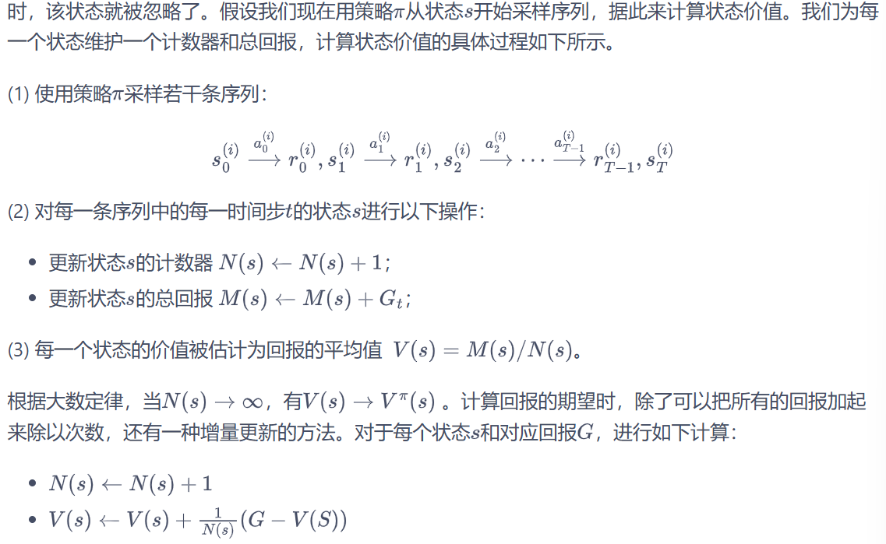


## Chapter 3 Dynamic Programming

### 3.1 概念

1. 基于模型的强化学习：要求事先知道或者根据智能体与环境交互采样到的数据学习得到环境的状态转移函数和奖励函数，也就是需要知道整个马尔可夫决策过程
2. 类型：

**策略迭代：策略评估+策略提升**

价值迭代


### 3.2 悬崖漫步问题（Q表格）


如图所示，有一个4X12 的悬崖网格，最下面一排除了起点和终点都是悬崖。如果智能体采取动作后触碰到边界墙壁则状态不发生改变，否则就会相应到达下一个状态。环境中有一段悬崖，智能体掉入悬崖或到达目标状态都会结束动作并回到起点，也就是说掉入悬崖或者达到目标状态是终止状态。智能体每走一步的奖励是 −1，掉入悬崖的奖励是 −100。

```python
import numpy as np
import matplotlib.pyplot as plt


class CliffWalkingEnv:
    """ 悬崖漫步环境"""
    def __init__(self, ncol=12, nrow=4):
        self.ncol = ncol  # 定义网格世界的列
        self.nrow = nrow  # 定义网格世界的行
        # 转移矩阵P[state][action] = [(p, next_state, reward, done)]包含下一个状态和奖励，done表示动作是否终止（是否到达悬崖或终点）
        self.P = self.createP()
    
    def createP(self):
        # 初始化
        P = [[[] for _ in range(4)] for _ in range(self.nrow * self.ncol)]
        # 4种动作, change[0]:上,change[1]:下, change[2]:左, change[3]:右。坐标系原点(0,0)在左上角
        change = [[0, -1], [0, 1], [-1, 0], [1, 0]]
        for i in range(self.nrow):
            for j in range(self.ncol):
                for a in range(4): #此时遍历change里面的四个动作
                    # 位置在悬崖或终点时无法继续交互
                    if i == self.nrow - 1 and j > 0:
                        P[i * self.ncol + j][a] = [(1, i * self.ncol + j, 0, True)]
                        continue
                    
                    # 计算下一个位置
                    next_x = min(self.ncol - 1, max(0, j + change[a][0])) #防止超出左或上边界
                    next_y = min(self.nrow - 1, max(0, i + change[a][1])) #防止超出右或下边界
                    next_state = next_y * self.ncol + next_x #转化成一维索引
                    reward = -1
                    done = False
                    
                    # 判断下一个位置是否在悬崖或终点
                    if next_y == self.nrow - 1 and next_x > 0:
                        done = True
                        if next_x != self.ncol - 1:  # 悬崖
                            reward = -100
                    P[i * self.ncol + j][a] = [(1, next_state, reward, done)]
        return P


# 创建环境实例
env = CliffWalkingEnv(ncol=12, nrow=4)

# 初始化Q表
n_states = env.nrow * env.ncol
n_actions = 4
Q = np.zeros((n_states, n_actions))

# 超参数设置
alpha = 0.1    # 学习率
gamma = 0.99   # 折扣因子
epsilon = 0.1  # 探索率
num_episodes = 500  # 训练的总episode数

# 训练过程
rewards = []  # 记录每个episode的总奖励

for episode in range(num_episodes):
    state = 3 * env.ncol + 0  # 初始状态：左下角(3,0)
    done = False
    total_reward = 0
    
    while not done:
        # epsilon-greedy选择动作
        if np.random.rand() < epsilon:
            action = np.random.randint(n_actions)
        else:
            action = np.argmax(Q[state])
        
        # 执行动作，得到转移信息
        p, next_state, reward, done = env.P[state][action][0]
        
        # 更新Q表
        Q[state][action] += alpha * (reward + gamma * np.max(Q[next_state]) - Q[state][action])
        
        # 更新状态和总奖励
        state = next_state
        total_reward += reward
        
    rewards.append(total_reward)

# 测试策略
def test_policy(Q):
    state = 3 * env.ncol + 0  # 初始状态
    path = []
    done = False
    while not done:
        action = np.argmax(Q[state])
        path.append((state // env.ncol, state % env.ncol))  # 记录坐标
        p, next_state, reward, done = env.P[state][action][0]
        state = next_state
        if len(path) > 100:  # 防止无限循环
            break
    path.append((state // env.ncol, state % env.ncol))  # 添加终点
    return path

# 可视化结果
path = test_policy(Q)
print("最优路径坐标序列：")
print(path)

# 绘制训练曲线
plt.plot(rewards)
plt.xlabel('Episode')
plt.ylabel('Total Reward')
plt.title('Q-learning Training Performance')
plt.show()
```


### 3.3 策略迭代算法

1. **策略评估**：计算一个策略π下从状态s出发可以得到的**状态价值函数**

贝尔曼期望方程：$V^\pi(s)=\sum_{a\in A}\pi(a\mid s)\left(R(s,a)+\gamma\sum_{s^{\prime}\in S}p\left(s^{\prime}\mid s,a\right)V^\pi\left(s^{\prime}\right)\right)$

使用上一轮的状态价值函数来计算当前一轮的状态价值函数：$V^{k+1}(s)=\sum_{a\in A}\pi(a|s)\left(r(s,a)+\gamma\sum_{s^{\prime}\in S}P(s^{\prime}|s,a)V^k(s^{\prime})\right)$

不动点：V^k = V^pi，因此如果某一轮 $\max_{s\in\mathcal{S}}|V^{k+1}(s)-V^{k}(s)|$的值非常小，可以提前结束策略评估。


2. **策略提升**：根据状态价值函数改进当前策略π，从而提高最终的期望回报$V^\pi(s)$，进而**得到一个更好的策略π’**

假设智能体在状态s下采取动作a，之后的动作依旧遵循策略π，此时的期望回报为$Q_{\pi}(s,a)$，如果$Q^{\pi}(s,a)>V^{\pi}(s)$，则说明在状态s下采取动作a会比原来的策略π得到更高的期望回报。

🙌最后一句话意思：通过在状态s下只选择某一个动作，去除加权平均，从而提高期望回报。

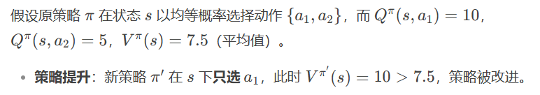


✨策略提升定理：现假设一个确定性策略π‘，在任意一个状态下，都满足：

$Q^\pi(s,\pi^{\prime}(s))\geq V^\pi(s)$

于是在任意状态下：

$$V^{\pi^{\prime}}(s)\geq V^\pi(s)$$

因此可以通过在每一个状态下选择动作价值最大的动作，从而提升最终的价值函数：

$\pi^{\prime}(s)=\arg\max_aQ^\pi(s,a)=\arg\max_a\{r(s,a)+\gamma\sum_{s^{\prime}}P(s^{\prime}|s,a)V^\pi(s^{\prime})\}$

🌟证明：关键是用到$V^{\pi}(S_{t+1})\leq Q^{\pi}(S_{t+1},\pi^{\prime}(S_{t+1}))$

$\begin{aligned}V^{\pi}(s)&\leq Q^{\pi}(s,\pi^{\prime}(s))\\&=\mathbb{E}_{\pi^{\prime}}[R_t+\gamma V^\pi(S_{t+1})|S_t=s]\\&\leq\mathbb{E}_{\pi^{\prime}}[R_t+\gamma Q^\pi(S_{t+1},\pi^{\prime}(S_{t+1}))|S_t=s]\\&=\mathbb{E}_{\pi^{\prime}}[R_t+\gamma R_{t+1}+\gamma^2V^\pi(S_{t+2})|S_t=s]\\&\leq\mathbb{E}_{\pi^{\prime}}[R_t+\gamma R_{t+1}+\gamma^2R_{t+2}+\gamma^3V^\pi(S_{t+3})|S_t=s]\\&\leq\mathbb{E}_{\pi^{\prime}}[R_t+\gamma R_{t+1}+\gamma^2R_{t+2}+\gamma^3R_{t+3}+\cdots|S_t=s]\\&=V^{\pi^{\prime}}(s)\end{aligned}$


3. **策略迭代算法：**

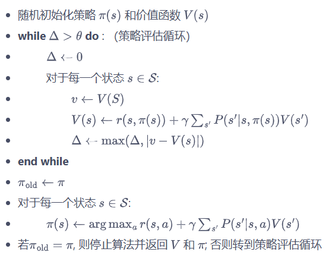


```python
import copy
import numpy as np
import sys
from collections import defaultdict

class PolicyIteration:
    """策略迭代算法"""
    def __init__(self, env, theta, gamma):
        self.env = env
        self.v = [0] * (self.env.ncol * self.env.nrow)  # 初始化价值函数
        # 初始化均匀随机策略（每个动作概率相等）
        self.pi = [[0.25] * 4 for _ in range(self.env.ncol * self.env.nrow)]
        self.theta = theta    # 策略评估收敛阈值
        self.gamma = gamma    # 折扣因子

    def compute_q_values(self, s):
        """计算指定状态下所有动作的Q值"""
        q_values = []
        for a in range(4):
            q = 0
            for trans_prob, next_state, reward, done in self.env.P[s][a]:
                # 计算Q值：考虑转移概率和终止状态处理
                q += trans_prob * (reward + self.gamma * self.v[next_state] * (1 - done))
            q_values.append(q)
        return q_values

    def policy_evaluation(self):
        """策略评估（使用当前策略更新价值函数）"""
        iteration = 0
        while True:
            max_diff = 0
            new_v = [0] * len(self.v)
            for s in range(len(self.v)):
                # 使用当前策略计算状态价值
                q_values = self.compute_q_values(s)
                new_v[s] = sum(self.pi[s][a] * q_values[a] for a in range(4))
                max_diff = max(max_diff, abs(new_v[s] - self.v[s]))
            
            self.v = new_v
            iteration += 1
            
            if max_diff < self.theta:
                print(f"策略评估经过{iteration}轮迭代后收敛")
                return

    def policy_improvement(self):
        """策略提升（根据当前价值函数优化策略）"""
        policy_stable = True # 策略是否稳定
        for s in range(len(self.v)):
            # 获取当前状态的所有Q值
            q_values = self.compute_q_values(s)
            
            # 找到最大Q值对应的动作
            max_q = max(q_values)
            best_actions = [a for a, q in enumerate(q_values) if q == max_q]
            
            # 构造新的策略（均匀分布在最优动作上）
            new_policy = [0.] * 4
            prob = 1.0 / len(best_actions)
            for a in best_actions:
                new_policy[a] = prob
                
            # 检查策略是否变化
            if self.pi[s] != new_policy:
                policy_stable = False
                
            self.pi[s] = new_policy
            
        return policy_stable

    def policy_iteration(self):
        """执行完整的策略迭代"""
        iteration = 0 # 迭代次数    
        while True:
            iteration += 1
            print(f"\n=== 策略迭代第{iteration}轮 ===")
            
            self.policy_evaluation()
            # 进行策略提升并检查策略稳定性
            if self.policy_improvement():
                print("策略已稳定，停止迭代")
                return

class CliffWalkingEnv:
    """悬崖漫步环境"""
    def __init__(self):
        self.ncol = 12  
        self.nrow = 4   
        self.P = self.createP()  

    def createP(self):
        P = defaultdict(dict)
        # 遍历所有状态
        for s in range(self.nrow * self.ncol):
            row, col = s // self.ncol, s % self.ncol
            P[s] = defaultdict(list)
            # 遍历所有动作
            for a in range(4):  # 上下左右四个动作
                # 计算下一个状态的位置
                next_s = self.step(row, col, a)
                next_row, next_col = next_s

                # 计算回报
                reward = -1.0
                # 如果下一个状态是悬崖或者终点
                if self.is_cliff(next_row, next_col):
                    done = True
                    reward = -100.0
                    next_s = self.encode_state(3, 0)  # 回到起点
                elif next_row == 3 and next_col == 11:
                    done = True  # 到达终点
                else:
                    done = False

                next_s = self.encode_state(next_row, next_col)
                P[s][a].append((1.0, next_s, reward, done))
        return P

    def step(self, row, col, action):
        """执行动作后的下一个位置"""
        if action == 0:  # 上
            next_row = max(row - 1, 0)
            next_col = col
        elif action == 1:  # 下
            next_row = min(row + 1, self.nrow - 1)
            next_col = col
        elif action == 2:  # 左
            next_row = row
            next_col = max(col - 1, 0)
        elif action == 3:  # 右
            next_row = row
            next_col = min(col + 1, self.ncol - 1)
        return next_row, next_col

    def encode_state(self, row, col):
        """将行列位置编码为一维状态索引"""
        return row * self.ncol + col

    def is_cliff(self, row, col):
        """判断是否是悬崖位置"""
        return row == 3 and 1 <= col <= 10
    
def print_agent(agent, action_meaning, disaster=[], end=[]):
    """可视化状态价值和策略"""
    print("状态价值：")
    grid_size = agent.env.ncol
    for i in range(agent.env.nrow):
        for j in range(grid_size):
            state = i * grid_size + j
            print(f"{agent.v[state]:6.3f}", end=" ")
        print()

    print("\n策略：")
    for i in range(agent.env.nrow):
        for j in range(grid_size):
            state = i * grid_size + j
            if state in disaster:
                print("XXXX", end=" ")
            elif state in end:
                print("EEEE", end=" ")
            else:
                policy = agent.pi[state]
                # 将策略转换为箭头表示
                arrows = [action_meaning[a] if prob > 0 else "" for a, prob in enumerate(policy)]
                combined = "".join(arrows).ljust(4, 'o')  # 保持4字符宽度
                print(combined, end=" ")
        print()
# 示例使用（需要CliffWalkingEnv环境实现）
if __name__ == "__main__":
    # 创建悬崖漫步环境实例
    env = CliffWalkingEnv()
    action_meaning = ['↑', '↓', '←', '→']  # 动作含义
    
    # 初始化策略迭代参数
    theta = 0.001
    gamma = 0.9
    agent = PolicyIteration(env, theta, gamma)
    
    # 执行策略迭代
    agent.policy_iteration()
    
    # 打印结果（悬崖状态37-46，终点47）
    print_agent(agent, action_meaning, list(range(37, 47)), [47])
```


### 3.4 价值迭代算法

1. 起因：

策略迭代中的策略评估需要进行很多轮才能收敛得到某一策略的状态函数，这需要很大的计算量，尤其是在状态和动作空间比较大的情况下


2. 价值迭代算法：

贝尔曼最优方程的更新公式：

$$V^{k+1}(s) = \max_{a\in A}\{r(s,a) + \gamma \sum_{s'\in S} P(s'|s,a)V^k(s')\}$$

价值迭代就是按照上述更新方式进行的。当 $V^{k+1}$ 和 $V^k$ 相同时，说明是贝尔曼最优方程的不动点，此时对应着最优状态价值函数 $V^*$。然后我们利用：

$$\pi(s) = \arg\max_a\{r(s,a) + \gamma \sum_{s'} p(s'|s,a)V^{k+1}(s')\}$$

从中恢复出最优策略即可。

价值迭代算法流程如下：

- 随机初始化 $V(s)$
- while $\Delta > \theta$ do:
  - $\Delta \leftarrow 0$
  - 对于每一个状态 $s \in S$:
    - $v \leftarrow V(s)$
    - $V(s) \leftarrow \max_a\{r(s,a) + \gamma \sum_{s'} P(s'|s,a)V(s')\}$
    - $\Delta \leftarrow \max(\Delta, |v - V(s)|)$
- end while
- 返回一个确定性策略 $\pi(s) = \arg\max_a\{r(s,a) + \gamma \sum_{s'} P(s'|s,a)V(s')\}$

```python
class ValueIteration:
    """ 价值迭代算法 """
    def __init__(self, env, theta, gamma):
        self.env = env
        self.v = [0] * self.env.ncol * self.env.nrow  # 初始化价值为0
        self.theta = theta  # 价值收敛阈值
        self.gamma = gamma
        # 价值迭代结束后得到的策略
        self.pi = [None for i in range(self.env.ncol * self.env.nrow)]

    def value_iteration(self):
        cnt = 0
        while 1:
            max_diff = 0
            new_v = [0] * self.env.ncol * self.env.nrow
            for s in range(self.env.ncol * self.env.nrow):
                qsa_list = []  # 开始计算状态s下的所有Q(s,a)价值
                for a in range(4):
                    qsa = 0
                    for res in self.env.P[s][a]:
                        p, next_state, r, done = res
                        qsa += p * (r + self.gamma * self.v[next_state] * (1 - done))
                    qsa_list.append(qsa)  # 这一行和下一行代码是价值迭代和策略迭代的主要区别
                new_v[s] = max(qsa_list)
                max_diff = max(max_diff, abs(new_v[s] - self.v[s]))
            self.v = new_v
            if max_diff < self.theta: break  # 满足收敛条件,退出评估迭代
            cnt += 1
        print("价值迭代一共进行%d轮" % cnt)
        self.get_policy()

    def get_policy(self):  # 根据价值函数导出一个贪婪策略
        for s in range(self.env.nrow * self.env.ncol):
            qsa_list = []
            for a in range(4):
                qsa = 0
                for res in self.env.P[s][a]:
                    p, next_state, r, done = res
                    qsa += p * (r + self.gamma * self.v[next_state] * (1 - done))
                qsa_list.append(qsa)
            maxq = max(qsa_list)
            cntq = qsa_list.count(maxq)  # 计算有几个动作得到了最大的Q值
            # 让这些动作均分概率
            self.pi[s] = [1 / cntq if q == maxq else 0 for q in qsa_list]


env = CliffWalkingEnv()
action_meaning = ['^', 'v', '<', '>']
theta = 0.001
gamma = 0.9
agent = ValueIteration(env, theta, gamma)
agent.value_iteration()
print_agent(agent, action_meaning, list(range(37, 47)), [47])
```


### 3.5 冰洞问题

网格世界，大小为4 × 4。每一个方格是一个状态，智能体起点状态S在左上角，目标状态G在右下角，中间还有若干冰洞H。在每一个状态都可以采取上、下、左、右 4 个动作。由于智能体在冰面行走，因此每次行走都有一定的概率滑行到附近的其它状态，并且到达冰洞或目标状态时行走会提前结束。每一步行走的奖励是 0，到达目标的奖励是 1。

```python
import gymnasium as gym 

class PolicyIteration:
    def __init__(self, env, theta, gamma):
        self.env = env
        self.n_states = env.observation_space.n  # 使用 observation_space.n 替代 nS
        self.n_actions = env.action_space.n      # 使用 action_space.n 替代 nA
        self.v = [0] * self.n_states            # 初始化价值函数
        self.pi = [[0.25] * self.n_actions for _ in range(self.n_states)]  # 初始化均匀随机策略
        self.theta = theta
        self.gamma = gamma

    def policy_evaluation(self):
        while True:
            delta = 0
            for s in range(self.n_states):
                v = self.v[s]
                self.v[s] = sum(self.pi[s][a] * sum(p * (r + self.gamma * self.v[next_s])
                    for p, next_s, r, _ in self.env.P[s][a]) for a in range(self.n_actions))
                delta = max(delta, abs(v - self.v[s]))
            if delta < self.theta:
                break

    def policy_improvement(self):
        policy_stable = True
        for s in range(self.n_states):
            old = self.pi[s].copy()
            q_values = [sum(p * (r + self.gamma * self.v[next_s])
                for p, next_s, r, _ in self.env.P[s][a]) for a in range(self.n_actions)]
            best_a = max(range(self.n_actions), key=lambda a: q_values[a])
            self.pi[s] = [1.0 if a == best_a else 0.0 for a in range(self.n_actions)]
            if old != self.pi[s]:
                policy_stable = False
        return policy_stable

    def policy_iteration(self):
        while True:
            self.policy_evaluation()
            if self.policy_improvement():
                break

def print_agent(agent, action_meaning, disaster=[], end=[]):
    print("状态价值：")
    for i in range(4):
        for j in range(4):
            print(f'{agent.v[i*4+j]:6.2f}', end=' ')
        print()

    print("策略：")
    for i in range(4):
        for j in range(4):
            state = i * 4 + j
            if state in disaster:
                print('XXXX', end=' ')
            elif state in end:
                print('EEEE', end=' ')
            else:
                policy = agent.pi[state]
                arrows = [action_meaning[a] if prob > 0 else '' for a, prob in enumerate(policy)]
                print(''.join(arrows).ljust(4, 'o'), end=' ')
        print()


env = gym.make("FrozenLake-v1")  # 创建环境
env = env.unwrapped  # 解封装才能访问状态转移矩阵P
env.render()  # 环境渲染,通常是弹窗显示或打印出可视化的环境

holes = set()
ends = set()
for s in env.P:
    for a in env.P[s]:
        for s_ in env.P[s][a]:
            if s_[2] == 1.0:  # 获得奖励为1,代表是目标
                ends.add(s_[1])
            if s_[3] == True:
                holes.add(s_[1])
holes = holes - ends
print("冰洞的索引:", holes)
print("目标的索引:", ends)

for a in env.P[14]:  # 查看目标左边一格的状态转移信息
    print(env.P[14][a])
    
    
# 策略迭代算法
# 这个动作意义是Gym库针对冰湖环境事先规定好的
action_meaning = ['<', 'v', '>', '^']
theta = 1e-5
gamma = 0.9
agent = PolicyIteration(env, theta, gamma)
agent.policy_iteration()
print_agent(agent, action_meaning, [5, 7, 11, 12], [15])


#价值迭代算法
action_meaning = ['<', 'v', '>', '^']
theta = 1e-5
gamma = 0.9
agent = ValueIteration(env, theta, gamma)
agent.value_iteration()
print_agent(agent, action_meaning, [5, 7, 11, 12], [15])
```


## Chapter 4 Temporal Difference Algorithm

### 4.1 无模型的强化学习

1. 大部分强化学习现实场景，其马尔可夫决策过程的状态转移概率是

   无法写出来的，也就无法直接进行动态规划。在这种情况下，智能

   体只能和环境进行交互，通过采样到的数据来学习。


2. 特点：

* **不需要事先知道环境的奖励函数和状态转移函数**，而是直接使用和环境交互的过程中采样到的数据来学习。

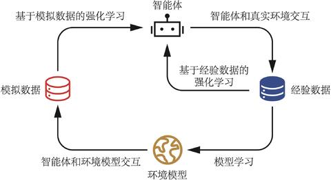


**策略评估（时序差分算法）+ 策略提升（Sarsa算法）**


### 4.2 时序差分算法

1. 策略评估：

时序差分算法用当前获得的奖励加上下一个状态的价值估计来作为在当前状态会

获得的回报,其表达式如下，相当于将蒙特卡洛算法中的Gt用$r_t+\gamma V(s_{t+1})$代替
$$
V(s_t)\leftarrow V(s_t)+\alpha[r_t+\gamma V(s_{t+1})-V(s_t)]
$$
注：$R_t+\gamma V(s_{t+1})-V(s_t)$为时序差分误差


2. 策略提升：

使用时序差分算法来估计动作价值函数Q；
$$
Q(s_t,a_t)\leftarrow Q(s_t,a_t)+\alpha[r_t+\gamma Q(s_{t+1},a_{t+1})-Q(s_t,a_t)]
$$
接着使用贪婪算法来选取在某个状态下动作价值最大的动作 - $\arg\max_{a}Q(s,a)$


3. 对比：

|              |                           偏差                           |                             方差                             |
| :----------: | :------------------------------------------------------: | :----------------------------------------------------------: |
| 蒙特卡洛方法 | 无偏（利用当前状态之后每一步的奖励而不使用任何价值估计） | 较大的方差（每一步的状态转移都有不确定性，而每一步状态采取的动作所得到的不一样的奖励最终都会加起来，这会极大影响最终的价值估计） |
| 时序差分方法 |   有偏（用到了下一个状态的价值估计而不是其真实的价值）   |       小方差（只关注了一步状态转移，用到了一步的奖励）       |


### 4.3 Sarsa算法

1. 算法：

(1) 使用时序差分算法来估计动作价值函数Q；
$$
Q(s_t,a_t)\leftarrow Q(s_t,a_t)+\alpha[r_t+\gamma Q(s_{t+1},a_{t+1})-Q(s_t,a_t)]
$$
接着使用贪婪算法来选取在某个状态下动作价值最大的动作 - $\arg\max_{a}Q(s,a)$

$\epsilon$-贪婪策略：有$1-\epsilon$的概率采用动作价值最大的那个动作，另外有$\epsilon$的概率从动作空间

中随机采取一个动作。
$$
\pi(a|s)=\begin{cases}\epsilon/|\mathcal{A}|+1-\epsilon&\quad\text{如果}a=\arg\max_{a^{\prime}}Q(s,a^{\prime})\\\epsilon/|\mathcal{A}|&\quad\text{其他动作}&\end{cases}
$$


(2) 算法过程：

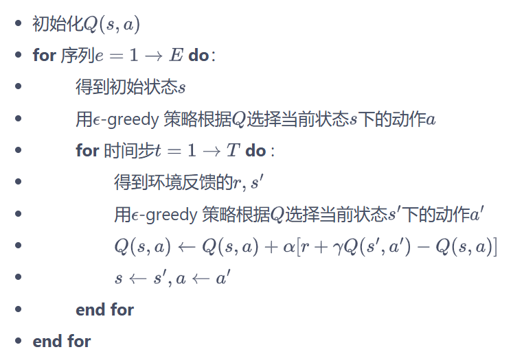

(3) 代码：

```python
import matplotlib.pyplot as plt
import numpy as np
from tqdm import tqdm  # tqdm是显示循环进度条的库


class CliffWalkingEnv:
    def __init__(self, ncol, nrow):
        self.nrow = nrow
        self.ncol = ncol
        self.x = 0  # 记录当前智能体位置的横坐标
        self.y = self.nrow - 1  # 记录当前智能体位置的纵坐标

    def step(self, action):  # 外部调用这个函数来改变当前位置
        # 4种动作, change[0]:上, change[1]:下, change[2]:左, change[3]:右。坐标系原点(0,0)
        # 定义在左上角
        change = [[0, -1], [0, 1], [-1, 0], [1, 0]]
        self.x = min(self.ncol - 1, max(0, self.x + change[action][0]))
        self.y = min(self.nrow - 1, max(0, self.y + change[action][1]))
        next_state = self.y * self.ncol + self.x
        reward = -1
        done = False
        if self.y == self.nrow - 1 and self.x > 0:  # 下一个位置在悬崖或者目标
            done = True
            if self.x != self.ncol - 1:
                reward = -100
        return next_state, reward, done

    def reset(self):  # 回归初始状态,坐标轴原点在左上角
        self.x = 0
        self.y = self.nrow - 1
        return self.y * self.ncol + self.x

class Sarsa:
    """ Sarsa算法 """
    def __init__(self, ncol, nrow, epsilon, alpha, gamma, n_action=4):
        self.Q_table = np.zeros([nrow * ncol, n_action])  # 初始化Q(s,a)表格
        self.n_action = n_action  # 动作个数
        self.alpha = alpha  # 学习率
        self.gamma = gamma  # 折扣因子
        self.epsilon = epsilon  # epsilon-贪婪策略中的参数

    def take_action(self, state):  # 选取下一步的操作,具体实现为epsilon-贪婪
        if np.random.random() < self.epsilon:
            action = np.random.randint(self.n_action)
        else:
            action = np.argmax(self.Q_table[state])
        return action

    def best_action(self, state):  # 用于打印策略
        Q_max = np.max(self.Q_table[state])
        a = [0 for _ in range(self.n_action)]
        for i in range(self.n_action):  # 若两个动作的价值一样,都会记录下来
            if self.Q_table[state, i] == Q_max:
                a[i] = 1
        return a

    def update(self, s0, a0, r, s1, a1):
        td_error = r + self.gamma * self.Q_table[s1, a1] - self.Q_table[s0, a0]
        self.Q_table[s0, a0] += self.alpha * td_error

ncol = 12
nrow = 4
env = CliffWalkingEnv(ncol, nrow)
np.random.seed(0)
epsilon = 0.1
alpha = 0.1
gamma = 0.9
agent = Sarsa(ncol, nrow, epsilon, alpha, gamma)
num_episodes = 500  # 智能体在环境中运行的序列的数量

return_list = []  # 记录每一条序列的回报
for i in range(10):  # 显示10个进度条
    # tqdm的进度条功能
    with tqdm(total=int(num_episodes / 10), desc='Iteration %d' % i) as pbar:
        for i_episode in range(int(num_episodes / 10)):  # 每个进度条的序列数
            episode_return = 0
            state = env.reset()
            action = agent.take_action(state)
            done = False
            while not done:
                next_state, reward, done = env.step(action)
                next_action = agent.take_action(next_state)
                episode_return += reward  # 这里回报的计算不进行折扣因子衰减
                agent.update(state, action, reward, next_state, next_action)
                state = next_state
                action = next_action
            return_list.append(episode_return)
            if (i_episode + 1) % 10 == 0:  # 每10条序列打印一下这10条序列的平均回报
                pbar.set_postfix({
                    'episode':
                    '%d' % (num_episodes / 10 * i + i_episode + 1),
                    'return':
                    '%.3f' % np.mean(return_list[-10:])
                })
            pbar.update(1)

episodes_list = list(range(len(return_list)))
plt.plot(episodes_list, return_list)
plt.xlabel('Episodes')
plt.ylabel('Returns')
plt.title('Sarsa on {}'.format('Cliff Walking'))
plt.show()


#Sarsa 算法得到的策略在各个状态下会使智能体采取什么样的动作
def print_agent(agent, env, action_meaning, disaster=[], end=[]):
    for i in range(env.nrow):
        for j in range(env.ncol):
            if (i * env.ncol + j) in disaster:
                print('****', end=' ')
            elif (i * env.ncol + j) in end:
                print('EEEE', end=' ')
            else:
                a = agent.best_action(i * env.ncol + j)
                pi_str = ''
                for k in range(len(action_meaning)):
                    pi_str += action_meaning[k] if a[k] > 0 else 'o'
                print(pi_str, end=' ')
        print()


action_meaning = ['^', 'v', '<', '>']
print('Sarsa算法最终收敛得到的策略为：')
print_agent(agent, env, action_meaning, list(range(37, 47)), [47])
```


### 4.4 多步Sarsa算法

1. 对比

|              |                           偏差                           |                             方差                             |
| :----------: | :------------------------------------------------------: | :----------------------------------------------------------: |
| 蒙特卡洛方法 | 无偏（利用当前状态之后每一步的奖励而不使用任何价值估计） | 较大的方差（每一步的状态转移都有不确定性，而每一步状态采取的动作所得到的不一样的奖励最终都会加起来，这会极大影响最终的价值估计） |
| 时序差分方法 |   有偏（用到了下一个状态的价值估计而不是其真实的价值）   |       小方差（只关注了一步状态转移，用到了一步的奖励）       |

2. 算法：

先计算n步的奖励：
$$
将G_t=r_t+\gamma Q(s_{t+1},a_{t+1})
$$

$$
替换成:
G_t=r_t+\gamma r_{t+1}+\cdots+\gamma^nQ(s_{t+n},a_{t+n})
$$

于是Sarsa中的动作价值函数变为：
$$
$Q(s_t,a_t)\leftarrow Q(s_t,a_t)+\alpha[r_t+\gamma Q(s_{t+1},a_{t+1})-Q(s_t,a_t)]
$$

$$
\text{替换成}Q(s_t,a_t)\leftarrow Q(s_t,a_t)+\alpha[r_t+\gamma r_{t+1}+\cdots+\gamma^nQ(s_{t+n},a_{t+n})-Q(s_t,a_t)]
$$

运行后发现五步比单步收敛速度更快

```python
class nstep_Sarsa:
    """ n步Sarsa算法 """
    def __init__(self, n, ncol, nrow, epsilon, alpha, gamma, n_action=4):
        self.Q_table = np.zeros([nrow * ncol, n_action])
        self.n_action = n_action
        self.alpha = alpha
        self.gamma = gamma
        self.epsilon = epsilon
        self.n = n  # 采用n步Sarsa算法
        self.state_list = []  # 保存之前的状态
        self.action_list = []  # 保存之前的动作
        self.reward_list = []  # 保存之前的奖励

    def take_action(self, state):
        if np.random.random() < self.epsilon:
            action = np.random.randint(self.n_action)
        else:
            action = np.argmax(self.Q_table[state])
        return action

    def best_action(self, state):  # 用于打印策略
        Q_max = np.max(self.Q_table[state])
        a = [0 for _ in range(self.n_action)]
        for i in range(self.n_action):
            if self.Q_table[state, i] == Q_max:
                a[i] = 1
        return a
    
#n步实现过程
    def update(self, s0, a0, r, s1, a1, done):
        self.state_list.append(s0)
        self.action_list.append(a0)
        self.reward_list.append(r)
        if len(self.state_list) == self.n:  # 若保存的数据可以进行n步更新
            G = self.Q_table[s1, a1]  # 得到Q(s_{t+n}, a_{t+n})
            for i in reversed(range(self.n)):
                G = self.gamma * G + self.reward_list[i]  # 不断向前计算每一步的回报
                # 如果到达终止状态,最后几步虽然长度不够n步,也将其进行更新
                if done and i > 0:
                    s = self.state_list[i]
                    a = self.action_list[i]
                    self.Q_table[s, a] += self.alpha * (G - self.Q_table[s, a])
            s = self.state_list.pop(0)  # 将需要更新的状态动作从列表中删除,下次不必更新
            a = self.action_list.pop(0)
            self.reward_list.pop(0)
            # n步Sarsa的主要更新步骤
            self.Q_table[s, a] += self.alpha * (G - self.Q_table[s, a])
        if done:  # 如果到达终止状态,即将开始下一条序列,则将列表全清空
            self.state_list = []
            self.action_list = []
            self.reward_list = []
            
np.random.seed(0)
n_step = 5  # 5步Sarsa算法
alpha = 0.1
epsilon = 0.1
gamma = 0.9
agent = nstep_Sarsa(n_step, ncol, nrow, epsilon, alpha, gamma)
num_episodes = 500  # 智能体在环境中运行的序列的数量

return_list = []  # 记录每一条序列的回报
for i in range(10):  # 显示10个进度条
    #tqdm的进度条功能
    with tqdm(total=int(num_episodes / 10), desc='Iteration %d' % i) as pbar:
        for i_episode in range(int(num_episodes / 10)):  # 每个进度条的序列数
            episode_return = 0
            state = env.reset()
            action = agent.take_action(state)
            done = False
            while not done:
                next_state, reward, done = env.step(action)
                next_action = agent.take_action(next_state)
                episode_return += reward  # 这里回报的计算不进行折扣因子衰减
                agent.update(state, action, reward, next_state, next_action,
                             done)
                state = next_state
                action = next_action
            return_list.append(episode_return)
            if (i_episode + 1) % 10 == 0:  # 每10条序列打印一下这10条序列的平均回报
                pbar.set_postfix({
                    'episode':
                    '%d' % (num_episodes / 10 * i + i_episode + 1),
                    'return':
                    '%.3f' % np.mean(return_list[-10:])
                })
            pbar.update(1)

episodes_list = list(range(len(return_list)))
plt.plot(episodes_list, return_list)
plt.xlabel('Episodes')
plt.ylabel('Returns')
plt.title('5-step Sarsa on {}'.format('Cliff Walking'))
plt.show()
```


### 4.5 Q-Learning

1. 算法：

(1) 时序差分更新方式：
$$
Q(s_t,a_t)\leftarrow Q(s_t,a_t)+\alpha[R_t+\gamma\max_aQ(s_{t+1},a_{t+1}-Q(s_t,a_t)]
$$
(2) 流程：

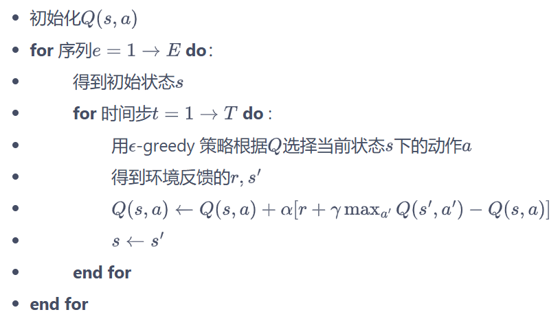

(3) 代码：

```python
class QLearning:
    """ Q-learning算法 """
    def __init__(self, ncol, nrow, epsilon, alpha, gamma, n_action=4):
        self.Q_table = np.zeros([nrow * ncol, n_action])  # 初始化Q(s,a)表格
        self.n_action = n_action  # 动作个数
        self.alpha = alpha  # 学习率
        self.gamma = gamma  # 折扣因子
        self.epsilon = epsilon  # epsilon-贪婪策略中的参数

    def take_action(self, state):  #选取下一步的操作
        if np.random.random() < self.epsilon:
            action = np.random.randint(self.n_action)
        else:
            action = np.argmax(self.Q_table[state])
        return action

    def best_action(self, state):  # 用于打印策略
        Q_max = np.max(self.Q_table[state])
        a = [0 for _ in range(self.n_action)]
        for i in range(self.n_action):
            if self.Q_table[state, i] == Q_max:
                a[i] = 1
        return a

    def update(self, s0, a0, r, s1):
        td_error = r + self.gamma * self.Q_table[s1].max(
        ) - self.Q_table[s0, a0]
        self.Q_table[s0, a0] += self.alpha * td_error
        
        
np.random.seed(0)
epsilon = 0.1
alpha = 0.1
gamma = 0.9
agent = QLearning(ncol, nrow, epsilon, alpha, gamma)
num_episodes = 500  # 智能体在环境中运行的序列的数量

return_list = []  # 记录每一条序列的回报
for i in range(10):  # 显示10个进度条
    # tqdm的进度条功能
    with tqdm(total=int(num_episodes / 10), desc='Iteration %d' % i) as pbar:
        for i_episode in range(int(num_episodes / 10)):  # 每个进度条的序列数
            episode_return = 0
            state = env.reset()
            done = False
            while not done:
                action = agent.take_action(state)
                next_state, reward, done = env.step(action)
                episode_return += reward  # 这里回报的计算不进行折扣因子衰减
                agent.update(state, action, reward, next_state)
                state = next_state
            return_list.append(episode_return)
            if (i_episode + 1) % 10 == 0:  # 每10条序列打印一下这10条序列的平均回报
                pbar.set_postfix({
                    'episode':
                    '%d' % (num_episodes / 10 * i + i_episode + 1),
                    'return':
                    '%.3f' % np.mean(return_list[-10:])
                })
            pbar.update(1)

episodes_list = list(range(len(return_list)))
plt.plot(episodes_list, return_list)
plt.xlabel('Episodes')
plt.ylabel('Returns')
plt.title('Q-learning on {}'.format('Cliff Walking'))
plt.show()

action_meaning = ['^', 'v', '<', '>']
print('Q-learning算法最终收敛得到的策略为：')
print_agent(agent, env, action_meaning, list(range(37, 47)), [47])
```


#### 2. 在线策略和离线策略：

(1) Sarsa - on-policy：更新公式必须使用当前贪心策略采样得到的五元组(s, a, r, s', a')来更新当前状态动作对的价值Q(s', a').

(其中的a'是当前策略在s'下的动作)


(2) Q-Learning -off-policy：更新公式使用四元组(s, a, r, s')来更新当前状态动作对的价值Q(s, a)。

(其中s, a是给定的条件，r和s'均是环境中采样，因此不需要一定是当前策略采样得到的数据，也可以是自行为策略)

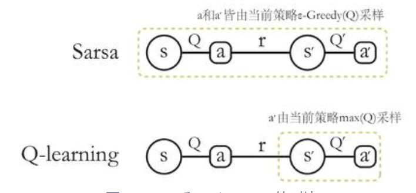


(3) 概念：在线策略（on-policy）算法表示行为策略和目标策略是同一个策略；而离线策略（off-policy）算法表示行为策略和目标策略不是同一个策略

行为策略：采样数据的策略

目标策略：用这些数据来更新的策略


## Chapter 5 Dyna-Q Algorithm

### 5.1  Dyna-Q(基于模型) 

1. 算法：

* 使用Q-planning 的方法来基于模型生成一些模拟数据，然后用模拟数据和真实数据一起改进策略。

* 在每次与环境进行交互执行一次 Q-learning 之后，Dyna-Q 会做n次 Q-planning:

Q-planning 每次选取一个曾经访问过的状态$s$，采取一个曾经在该状态下执行过的动作$a$

，通过模型得到转移后的状态$s'$以及奖励$r$，并根据这个模拟数据(s, a, r, s')，用 Q-

learning 的更新方式来更新动作价值函数。

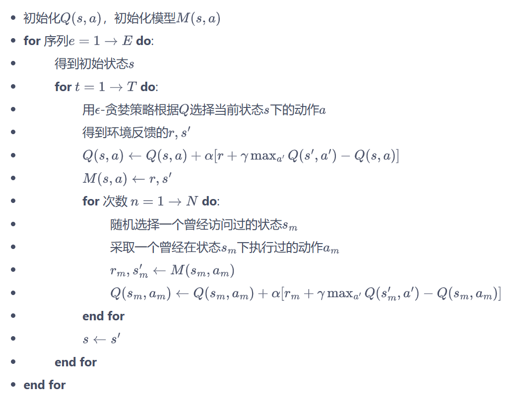

2. 代码：

```python
import matplotlib.pyplot as plt
import numpy as np
from tqdm import tqdm
import random
import time


class CliffWalkingEnv:
    def __init__(self, ncol, nrow):
        self.nrow = nrow
        self.ncol = ncol
        self.x = 0  # 记录当前智能体位置的横坐标
        self.y = self.nrow - 1  # 记录当前智能体位置的纵坐标

    def step(self, action):  # 外部调用这个函数来改变当前位置
        # 4种动作, change[0]:上, change[1]:下, change[2]:左, change[3]:右。坐标系原点(0,0)
        # 定义在左上角
        change = [[0, -1], [0, 1], [-1, 0], [1, 0]]
        self.x = min(self.ncol - 1, max(0, self.x + change[action][0]))
        self.y = min(self.nrow - 1, max(0, self.y + change[action][1]))
        next_state = self.y * self.ncol + self.x
        reward = -1
        done = False
        if self.y == self.nrow - 1 and self.x > 0:  # 下一个位置在悬崖或者目标
            done = True
            if self.x != self.ncol - 1:
                reward = -100
        return next_state, reward, done

    def reset(self):  # 回归初始状态,起点在左上角
        self.x = 0
        self.y = self.nrow - 1
        return self.y * self.ncol + self.x
   
class DynaQ:
    """ Dyna-Q算法 """
    def __init__(self,
                 ncol,
                 nrow,
                 epsilon,
                 alpha,
                 gamma,
                 n_planning,
                 n_action=4):
        self.Q_table = np.zeros([nrow * ncol, n_action])  # 初始化Q(s,a)表格
        self.n_action = n_action  # 动作个数
        self.alpha = alpha  # 学习率
        self.gamma = gamma  # 折扣因子
        self.epsilon = epsilon  # epsilon-贪婪策略中的参数

        self.n_planning = n_planning  #执行Q-planning的次数, 对应1次Q-learning
        self.model = dict()  # 环境模型

    def take_action(self, state):  # 选取下一步的操作
        if np.random.random() < self.epsilon:
            action = np.random.randint(self.n_action)
        else:
            action = np.argmax(self.Q_table[state])
        return action

    def q_learning(self, s0, a0, r, s1):
        td_error = r + self.gamma * self.Q_table[s1].max(
        ) - self.Q_table[s0, a0]
        self.Q_table[s0, a0] += self.alpha * td_error

    def update(self, s0, a0, r, s1):
        self.q_learning(s0, a0, r, s1)
        self.model[(s0, a0)] = r, s1  # 将数据添加到模型中
        for _ in range(self.n_planning):  # Q-planning循环
            # 随机选择曾经遇到过的状态动作对
            (s, a), (r, s_) = random.choice(list(self.model.items()))
            self.q_learning(s, a, r, s_)
            
def DynaQ_CliffWalking(n_planning):
    ncol = 12
    nrow = 4
    env = CliffWalkingEnv(ncol, nrow)
    epsilon = 0.01
    alpha = 0.1
    gamma = 0.9
    agent = DynaQ(ncol, nrow, epsilon, alpha, gamma, n_planning)
    num_episodes = 300  # 智能体在环境中运行多少条序列

    return_list = []  # 记录每一条序列的回报
    for i in range(10):  # 显示10个进度条
        # tqdm的进度条功能
        with tqdm(total=int(num_episodes / 10),
                  desc='Iteration %d' % i) as pbar:
            for i_episode in range(int(num_episodes / 10)):  # 每个进度条的序列数
                episode_return = 0
                state = env.reset()
                done = False
                while not done:
                    action = agent.take_action(state)
                    next_state, reward, done = env.step(action)
                    episode_return += reward  # 这里回报的计算不进行折扣因子衰减
                    agent.update(state, action, reward, next_state)
                    state = next_state
                return_list.append(episode_return)
                if (i_episode + 1) % 10 == 0:  # 每10条序列打印一下这10条序列的平均回报
                    pbar.set_postfix({
                        'episode':
                        '%d' % (num_episodes / 10 * i + i_episode + 1),
                        'return':
                        '%.3f' % np.mean(return_list[-10:])
                    })
                pbar.update(1)
    return return_list

np.random.seed(0)
random.seed(0)
n_planning_list = [0, 2, 20]
for n_planning in n_planning_list:
    print('Q-planning步数为：%d' % n_planning)
    time.sleep(0.5)
    return_list = DynaQ_CliffWalking(n_planning)
    episodes_list = list(range(len(return_list)))
    plt.plot(episodes_list,
             return_list,
             label=str(n_planning) + ' planning steps')
plt.legend()
plt.xlabel('Episodes')
plt.ylabel('Returns')
plt.title('Dyna-Q on {}'.format('Cliff Walking'))
plt.show()
```


# Deep Reforcement Learning

[CS 285: Lecture 1, Introduction. Part 2](https://www.youtube.com/watch?v=BYh36cb92JQ&list=PL_iWQOsE6TfVYGEGiAOMaOzzv41Jfm_Ps&index=2)

[berkeleydeeprlcourse/homework_fall2023](https://github.com/berkeleydeeprlcourse/homework_fall2023)

[Welcome to Spinning Up in Deep RL! — Spinning Up documentation](https://spinningup.openai.com/en/latest/)

## 

## Chapter 6 DQN Algorithm

### 6.1 DQN

1. 函数拟合：

类似车杆的环境中得到动作价值函数Q(s, a)，由于状态每一维度的值都是连续的，无法使用表格记录，因此一个常见的解决方法便是使用**函数拟合**


2. 神经网络：

* 动作连续：输入为状态s和动作a，输出标量，表示在状态s下采取动作a能获得的价值。

* 动作离散：输入仅为状态s，并输出每一个动作的Q值。

* Q网络：每一个状态s下所有可能动作a的Q值为$Q_\omega(s,a)$，其中$\omega$为神经网络用来拟合函数的参数。

  用于拟合Q函数的神经网络（DQN由于其函数Q在更新过程中有maxa操作，因此只能处理动作离散的情况）


3. 深度Q网络(DQN)：

$$
Q(s,a)\leftarrow Q(s,a)+\alpha\left[r+\gamma\max_{a^{\prime}\in\mathcal{A}}Q(s^{\prime},a^{\prime})-Q(s,a)\right]
$$

上述公式使用TD学习目标$r+\gamma\max_{a^{\prime}\in\mathcal{A}}Q(s^{\prime},a^{\prime})$来增量式更新Q(s, a)，因此需**要让Q(s, a)和TD目标$r+\gamma\max_{a^{\prime}\in\mathcal{A}}Q(s^{\prime},a^{\prime})$靠近**，可以设计Q网络的损失函数为均方误差的形式：
$$
\omega^*=\arg\min_\omega\frac{1}{2N}\sum_{i=1}^N\left[Q_\omega\left(s_i,a_i\right)-\left(r_i+\gamma\max_{a^{\prime}}Q_\omega\left(s_i^{\prime},a^{\prime}\right)\right)\right]^2
$$


4. 模块解释：

(1) 经验回放：

维护一个**回放缓冲区**，将每次从环境中采样得到的四元组数据（状态、动作、奖励、下一个状态）存储到回放缓冲区，训练Q网络的时候再从回放缓冲区中随机采样若干数据来训练，从而实现：

* 使样本满足独立假设。在 MDP 中交互采样得到的数据本身不满足独立假设，因为这一时刻的状态和上一时刻的状态有关。非独立同分布的数据对训练神经网络有很大的影响，会使神经网络拟合到最近训练的数据上。采用经验回放可以打破样本之间的相关性，让其满足独立假设。
* 提高样本效率。每一个样本可以被使用多次，十分适合深度神经网络的梯度学习。


(2) 目标网络：

在更新网络参数时目标也在不断改变，因此先将TD目标中的Q网络固定，需要两套Q网络。

* 原来的**训练网络**$Q_\omega(s,a)$：用于计算原来的损失函数$\frac{1}{2}[Q_{\omega}\left(s,a\right)-\left(r+\gamma\max_{a^{\prime}}Q_{\omega^{-}}\left(s^{\prime},a^{\prime}\right)\right)]^{2}$中的$Q_\omega(s,a)$，并使用正常梯度下降方法来进行更新。
* **目标网络**$Q_{\omega^-}(s,a)$：用于计算原先损失函数$\frac{1}{2}[Q_{\omega}\left(s,a\right)-\left(r+\gamma\max_{a^{\prime}}Q_{\omega^{-}}\left(s^{\prime},a^{\prime}\right)\right)]^{2}$中的$(r+\gamma\max_{a^{\prime}}Q_{\omega^{-}}(s^{\prime},a^{\prime}))$项，其中$\omega^-$表示目标网络中的参数。

✨为了让更新目标稳定，：

目标网络使用训练网络的一套较旧的参数，训练网络在训练中的每

一步都会更新，而目标网络的参数每隔C步才会与训练网络同步一

次（$\omega^{-}\leftarrow\omega$）


5. 算法流程：


### 6.2 DQN改进算法

1. Double DQN

(1) 普通DQN算法会导致对Q值的过高估计：

传统DQN的TD优化目标    $Q_{\omega^-}\left(s^\prime,\arg\max_{a^\prime}Q_{\omega^-}\left(s^\prime,a^\prime\right)\right)$

当两部分采用同一个Q网络进行计算时，得到的都是神经网络当前估算的所有动作价值中的最大值。

由于神经网络计算的Q值会有正向或负向的误差，在DQN的更新方式下神经网络会将正向误差累计。

EG：

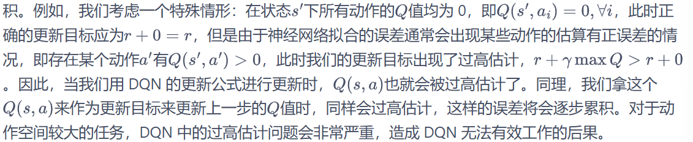


(2) double DQN算法：

✨使用两个独立训练的神经网络估算价值函数$Q_{\omega^-}\left(s^\prime,\arg\max_{a^\prime}Q_{\omega}\left(s^\prime,a^\prime\right)\right)$

* 训练网络$Q_{\omega}$的输出选取价值最大的动作：

$$
a^*=\arg\max_{a^\prime}Q_{\omega}\left(s^\prime,a^\prime\right)
$$


* 目标网络$Q_{\omega^-}$计算该动作的价值：

$$
Q_{\omega^{-}}\left(s^{\prime},\arg\max_{a^{\prime}}Q_{\omega}\left(s^{\prime},a^{\prime}\right)\right)
$$


* Double DQN的优化目标：

$$
r+\gamma Q_{\omega^-}\left(s^{\prime},\arg\max_{a^{\prime}}Q_\omega\left(s^{\prime},a^{\prime}\right)\right)
$$


2. Dueling DQN

(1) 优势函数：同一状态下，所有动作的优势值之和为0，即所有动作的动作价值的期望就是这个状态的状态价值。
$$
A(s,a)=Q(s,a)-V(s)
$$


(2) Dueling DQN：
$$
Q_{\eta,\alpha,\beta}(s,a)=V_{\eta,\alpha}(s)+A_{\eta,\beta}(s,a)
$$
其中，V为状态价值函数；A为该状态下采取不同动作的优势函数，表示采取不同动作的差异性。


(3) 网络架构：

训练神经网络的最后几层的两个分支，分别输出状态价值函数和优势函数，再求和得到Q值。

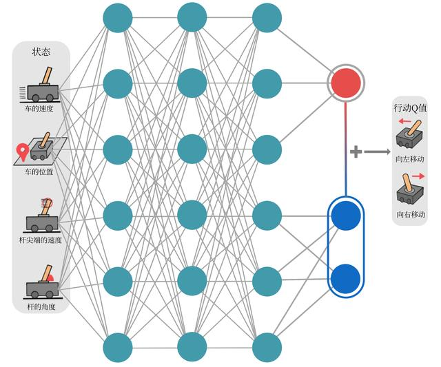


(4) 不唯一性问题：

* 仅仅是简单地将 V(s) 和 A(s,a) 相加得到 Q(s,a)，那么存在无限多组 (V(s),A(s,a)) 的组合可以得到相同的 Q(s,a) 

​       EG：如果神经网络发现某个 Q(s,a) 被低估了，它可以选择增加 V(s)，或者增加 A(s,a)，或者同时增加两者的一部分，这导致了 V(s) 和 A(s,a) 的估计可能变得不稳定或不准确。

* 减去最大优势值：强制最优动作的优势函数的实际输出为0 。$V(s)=\max_aQ(s,a)$

$$
Q_{\eta,\alpha,\beta}(s,a)=V_{\eta,\alpha}(s)+A_{\eta,\beta}(s,a)-\max_{a^{\prime}}A_{\eta,\beta}\begin{pmatrix}s,a^{\prime}\end{pmatrix}
$$


* 减去平均优势值：$\sum_{a^\prime}(A(s,a^\prime;\theta,\alpha)-\frac{1}{|\mathcal{A}|}\sum_{a^{\prime\prime}}A(s,a^{\prime\prime};\theta,\alpha))=0$ 将优势值相对于他们的平均值进行中心化，消除了A(s, a)中的任意常数偏移，从而V(s)能够唯一地表示状态的真实价值。$V(s)=\frac{1}{|\mathcal{A}|}\sum_{a^{\prime}}Q(s,a^{\prime})$

$$
Q_{\eta,\alpha,\beta}(s,a)=V_{\eta,\alpha}(s)+A_{\eta,\beta}(s,a)-\frac{1}{|\mathcal{A}|}\sum_{a^{\prime}}A_{\eta,\beta}\left(s,a^{\prime}\right)
$$


## Chapter 7 策略梯度算法

**基于策略的方法：直接显式地学习一个目标策略**

### 7.1 策略梯度

1. 假设目标策略$\pi_{\theta}$是一个随机性策略，且处处可微，其中$\theta$是对应的参数，可以用一个线性模型或神经网络模型来为其建模：输入某个状态，输出一个动作的概率分布，目标是寻找一个最优策略并最大化这个策略在环境中的期望回报（S0表示初始状态）


$$
J(\theta)=\mathbb{E}_{s_0}[V^{\pi_\theta}(s_0)]
$$

2. 梯度上升：将目标函数对$\theta$求导，从而使用**梯度上升**从而找到$\theta^*=\arg\max_\theta J(\theta)$来最大化目标函数(等价于让策略更多地去采样到带来较高Q值的动作)，从而得到最优策略

$$
\begin{aligned}\nabla_\theta J(\theta)&\propto\sum_{s\in S}\nu^{\pi_\theta}(s)\sum_{a\in A}Q^{\pi_\theta}(s,a)\nabla_\theta\pi_\theta(a|s)\\&=\sum_{s\in S}\nu^{\pi_\theta}(s)\sum_{a\in A}\pi_\theta(a|s)Q^{\pi_\theta}(s,a)\frac{\nabla_\theta\pi_\theta(a|s)}{\pi_\theta(a|s)}\\&=\mathbb{E}_{\pi_\theta}[Q^{\pi_\theta}(s,a)\nabla_\theta\log\pi_\theta(a|s)]\end{aligned}
$$

3. 在线策略算法：上式中期望E的下标为$\pi_{\theta}$，故必须使用当前策略$\pi_{\theta}$采样得到的数据来计算梯度。

4. Reinforce算法：使用蒙特卡洛算法估计$Q^{\pi_\theta}(s,a)$


### 7.2 Reinforce算法

1. 计算策略梯度：

对于一个有限步数的环境来说：
$$
\nabla_\theta J(\theta)=\mathbb{E}_{\pi_\theta}\left[\sum_{t=0}^T\left(\sum_{t^\prime=t}^T\gamma^{t^\prime-t}r_{t^\prime}\right)\nabla_\theta\log\pi_\theta(a_t|s_t)\right]
$$
其中，T是和环境交互的最大步数


2. 算法流程：

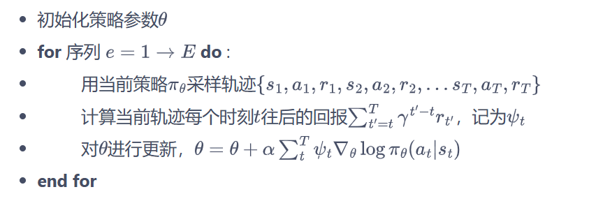


3. 证明：

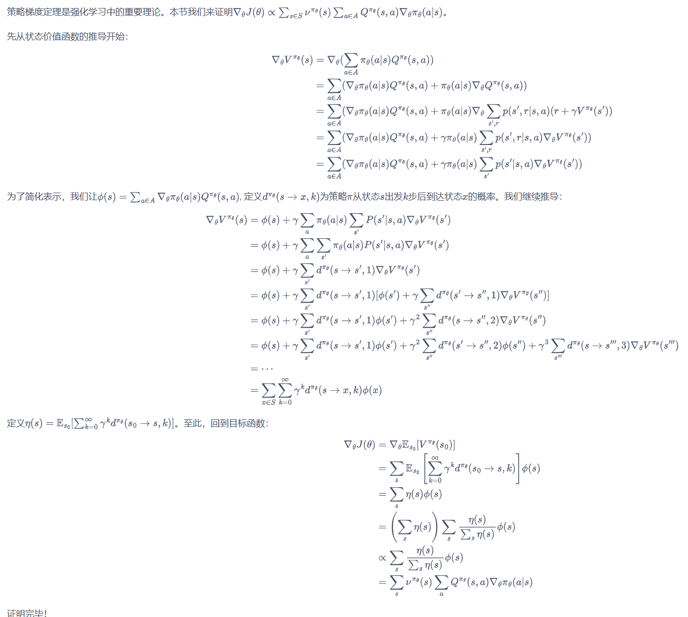


## Chapter 8 Actor-Critic 算法

### 8.1 Actor-Critic

1. Intro：

本质是基于策略的算法，但会额外学习价值函数，从而帮助策略函数更好地学习。

2. 梯度更新方式：

将策略梯度写成如下形式：
$$
g=\mathbb{E}\left[\sum_{t=0}^T\psi_t\nabla_\theta\log\pi_\theta(a_t|s_t)\right]
$$
$\psi_t$形式如下：
$$
\begin{aligned}&1.\sum_{t^{\prime}=0}^T\gamma^{t^{\prime}}r_{t^{\prime}}:\text{轨迹的总回报;}\\&2.\sum_{t^{\prime}=t}^T\gamma^{t^{\prime}-t}r_{t^{\prime}}:\text{动作}a_t\text{之后的回报;}\\&3.\sum_{t^{\prime}=t}^T\gamma^{t^{\prime}-t}r_{t^{\prime}}-b(s_t):\text{基准线版本的改进;}\\&4.Q^{\pi_\theta}(s_t,a_t):\text{动作价值函数;}\\&5.A^{\pi_\theta}(s_t,a_t):\text{优势函数;}\\&6.r_t+\gamma V^{\pi_\theta}(s_{t+1})-V^{\pi_\theta}(s_t):\text{时序差分残差。}\end{aligned}
$$
(3) 由于REINFORCE通过蒙特卡洛采样方法对策略梯度的估计是无偏的，但是方差很大。可以引入基线函数b(st)来减小方差

(4) 估计动作价值函数Q，代替蒙特卡洛采样得到的回报

(5) 优势函数：将状态价值函数V作为基线，A  = Q - V

(6) 时序差分残差：Q = r + γV


3. 算法步骤：

(1) Actor(策略网络): 与环境交互，并在Critic价值函数的指导下用**策略梯度**学习一个更好的策略。


(2) Critic(价值网络): 通过 Actor 与环境交互收集的数据学习一个价值函数，这个价值函数会用于判断在当前状态什么动作是好的，什么动作不是好的，进而帮助 Actor 进行策略更新。

更新方式：梯度下降更新Critic价值网络参数

价值函数的损失函数：
$$
\mathcal{L}(\omega)=\frac{1}{2}(r+\gamma V_\omega(s_{t+1})-V_\omega(s_t))^2
$$
价值函数的梯度：将上述$r+\gamma V_\omega(s_{t+1})$作为时序差分目标，不会产生梯度来更新价值函数
$$
\nabla_\omega\mathcal{L}(\omega)=-(r+\gamma V_\omega(s_{t+1})-V_\omega(s_t))\nabla_\omega V_\omega(s_t)
$$
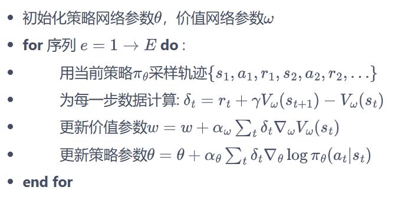


## Chapter 9 TRPO 算法

由于策略的改变导致数据分布的改变，这大大影响深度模型实现的策略网络的学习效果，所以通过划定一个可信任的策略学习区域，保证策略学习的稳定性和有效性。

### 9.1 策略目标

1. Intro

Q:基于策略的方法沿着梯度去更新策略参数，但是当策略网络是深度模型，沿着策略梯度更新参数，会由于步长太长，策略显著变差，从而影响训练效果。

在更新策略时找到一块信任区域，在这个区域上更新策略时能够得到某种策略性能的安全性保证


2. 策略目标：

(1) 假设当前策略为$\pi_{\theta}$，参数为$\theta$，那么优化的目标为借助当前的$\theta$找到一个更优的参数$\theta^{\prime}$，使得$J(\theta^{\prime})\geq J(\theta)$。由于初始状态S0的分布与策略无关，因此上述策略$\pi_{\theta}$下的优化目标$J(\theta)$可以写成在新策略$\pi_{\theta^{\prime}}$的期望形式
$$
\begin{aligned}J(\theta)&=\mathbb{E}_{s_0}[V^{\pi_\theta}(s_0)]\\&=\mathbb{E}_{\pi_{\theta^{\prime}}}\left[\sum_{t=0}^\infty\gamma^tV^{\pi_\theta}(s_t)-\sum_{t=1}^\infty\gamma^tV^{\pi_\theta}(s_t)\right]\\&=-\mathbb{E}_{\pi_{\theta^{\prime}}}\left[\sum_{t=0}^\infty\gamma^t\left(\gamma V^{\pi_\theta}(s_{t+1})-V^{\pi_\theta}(s_t)\right)\right]\end{aligned}
$$
新旧策略的目标函数差距：
$$
\begin{aligned}J(\theta^{\prime})-J(\theta)&=\mathbb{E}_{s_0}\left[V^{\pi_{\theta^{\prime}}}(s_0)\right]-\mathbb{E}_{s_0}\left[V^{\pi_\theta}(s_0)\right]\\&=\mathbb{E}_{\pi_{\theta^{\prime}}}\left[\sum_{t=0}^\infty\gamma^tr(s_t,a_t)\right]+\mathbb{E}_{\pi_{\theta^{\prime}}}\left[\sum_{t=0}^\infty\gamma^t\left(\gamma V^{\pi_\theta}(s_{t+1})-V^{\pi_\theta}(s_t)\right)\right]\\&=\mathbb{E}_{\pi_{\theta^{\prime}}}\left[\sum_{t=0}^\infty\gamma^t\left[r(s_t,a_t)+\gamma V^{\pi_\theta}(s_{t+1})-V^{\pi_\theta}(s_t)\right]\right]\\&=\mathbb{E}_{\pi_{\theta^{\prime}}}\left[\sum_{t=0}^\infty\gamma^tA^{\pi_\theta}(s_t,a_t)\right](将时序差分残差定义为优势函数A)\\&=\sum_{t=0}^\infty\gamma^t\mathbb{E}_{s_t\sim P_t^{\pi_{\theta^{\prime}}}}\mathbb{E}_{a_t\sim\pi_{\theta^{\prime}}(\cdot|s_t)}\left[A^{\pi_\theta}(s_t,a_t)\right]\\&=\frac{1}{1-\gamma}\mathbb{E}_{s\sim\nu^{\pi_{\theta^{\prime}}}}\mathbb{E}_{a\sim\pi_{\theta^{\prime}}(\cdot|s)}\left[A^{\pi_\theta}(s,a)\right]\end{aligned}
$$
(最后一个等号由状态空间的访问分布得到，所以只需要找到一个新策略，使得$\mathbb{E}_{s\sim\nu^{\pi_{\theta^{\prime}}}}\mathbb{E}_{a\sim\pi_{\theta^{\prime}}(\cdot|s)}\left[A^{\pi_{\theta}}(s,a)\right]\geq0$就能保证策略性单调递增，即$J(\theta^{\prime})\geq J(\theta)$)


(2) 近似处理：

当新旧策略非常接近时，状态访问分布变化很小，可以近似忽略，直接采用旧的策略$\pi_{\theta}$的状态分布，定义如下替代优化目标：
$$
L_\theta(\theta^{\prime})=J(\theta)+\frac{1}{1-\gamma}\mathbb{E}_{s\sim\nu^{\pi_\theta}}\mathbb{E}_{a\sim\pi_{\theta^{\prime}}(\cdot|s)}\left[A^{\pi_\theta}(s,a)\right]
$$
用重要性采样对动作分布进行处理:
$$
L_\theta(\theta^{\prime})=J(\theta)+\mathbb{E}_{s\sim\nu^{\pi_\theta}}\mathbb{E}_{a\sim\pi_\theta(\cdot|s)}\left[\frac{\pi_{\theta^{\prime}}(a|s)}{\pi_\theta(a|s)}A^{\pi_\theta}(s,a)\right]
$$
接下来基于旧策略$\pi_{\theta}$已经采样出来的数据来估计并优化新策略$\pi_{\theta^{\prime}}$；为了保证新旧策略足够接近，使用Kullback-Leibler散度来衡量策略之间的距离，并给出了整体的优化公式：
$$
\begin{aligned}&\max_{\theta^{\prime}}L_{\theta}(\theta^{\prime})\\&\mathrm{s.t.}\mathbb{E}_{s\sim\nu^{\pi_{\theta_{k}}}}[D_{KL}(\pi_{\theta_{k}}(\cdot|s),\pi_{\theta^{\prime}}(\cdot|s))]\leq\delta\end{aligned}
$$
由上述不等式，定义了策略空间的一个KL球—信任区域。在该区域内，可以认为当前学习策略和环境交互的状态分布与上一轮策略最后采样的状态分布一致，进而可以基于一步行动的重要性采样方法使当前学习策略稳定提升。

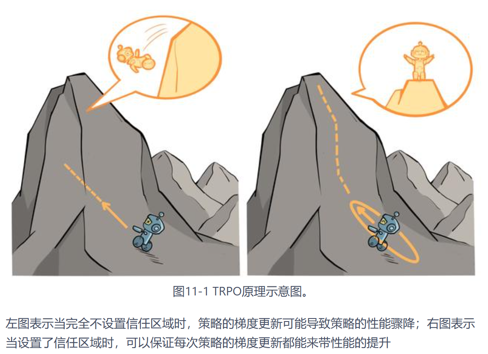


### 9.2 算法优化

#### 1.近似求解

做了一步近似操作，用$\theta_k$代替$\theta$(表示第k次迭代后的策略)，对目标和约束在$\theta_k$进行**泰勒展开**，分别用1阶和2阶进行近似：
$$
\mathbb{E}_{s\sim\nu^{\pi_{\theta_k}}}\mathbb{E}_{a\sim\pi_{\theta_k}(\cdot|s)}\left[\frac{\pi_{\theta^{\prime}}(a|s)}{\pi_{\theta_k}(a|s)}A^{\pi_{\theta_k}}(s,a)\right]\approx g^T(\theta^{\prime}-\theta_k)
$$

$$
\mathbb{E}_{s\sim\nu^{\pi_{\theta_k}}}[D_{KL}(\pi_{\theta_k}(\cdot|s),\pi_{\theta^{\prime}}(\cdot|s))]\approx\frac{1}{2}(\theta^{\prime}-\theta_k)^TH(\theta^{\prime}-\theta_k)
$$

其中，$g=\nabla_{\theta^{\prime}}\mathbb{E}_{s\sim\nu}^{\pi_{\theta_k}}\mathbb{E}_{a\sim\pi_{\theta_k}(\cdot|s)}\left[\frac{\pi_{\theta^{\prime}}(a|s)}{\pi_{\theta_k}(a|s)}A^{\pi_{\theta_k}}(s,a)\right]$表示目标函数的梯度

$H=\mathbf{H}[\mathbb{E}_{s\sim\nu^{\pi_{\theta_k}}}[D_{KL}(\pi_{\theta_k}(\cdot|s),\pi_{\theta^{\prime}}(\cdot|s))]$表示策略之前平均KL距离的黑塞矩阵（Hessian matrix）

于是优化目标变成了KL距离约束条件：
$$
✨\theta_{k+1}=\underset{\theta^{\prime}}{\operatorname*{\operatorname*{\arg\max}}}g^T(\theta^{\prime}-\theta_k)\quad\mathrm{s.t.}\quad\frac{1}{2}(\theta^{\prime}-\theta_k)^TH(\theta^{\prime}-\theta_k)\leq\delta
$$
使用Karush-Kuhn-Tucker（KKT）条件直接导出上述问题的解：
$$
✨\theta_{k+1}=\theta_k+\sqrt{\frac{2\delta}{g^TH^{-1}g}}H^{-1}g
$$


#### 2. 共轭梯度

假设满足KL距离约束的参数更新时的最大步长为$\beta$(步长为$\theta^{\prime}-\theta_k$)，根据KL距离约束条件，有$\frac{1}{2}(\beta x)^TH(\beta x)=\delta$，解出$\beta=\sqrt{\frac{2\delta}{x^{T}Hx}}$。此时参数更新方式为：
$$
✨\theta_{k+1}=\theta_k+\sqrt{\frac{2\delta}{x^THx}}x
$$
此时，直接计算$x=H^{-1}g$ (x为参数更新方向，H为正定矩阵 - 可以通过共轭梯度法求解)，即可更新参数。

✨**共轭梯度法**


为了减小计算量，只需计算Hx向量，而不是直接计算和存储H矩阵，因为对任意的列向量v，可以验证下式，即先用梯度和向量v点乘后计算梯度：
$$
Hv=\nabla_\theta\left(\left(\nabla_\theta(D_{KL}^{\nu^{\pi_{\theta_k}}}(\pi_{\theta_k},\pi_{\theta^{\prime}}))\right)^T\right)v=\nabla_\theta\left(\left(\nabla_\theta(D_{KL}^{\nu^{\pi_{\theta_k}}}(\pi_{\theta_k},\pi_{\theta^{\prime}}))\right)^Tv\right)
$$


#### 3. 线性搜索

TRPO在每次迭代的最后进行一次线性搜索，找到一个最小的非负整数i，使得按照
$$
\theta_{k+1}=\theta_k+\alpha^i\sqrt{\frac{2\delta}{x^THx}}x       \\\alpha\in(0,1) 决定线性搜索长度
$$
求出的$\theta_{k+1}$依然满足最初的KL散度限制，并且能够提升目标函数$L_{\theta_k}$


✨**TRPO算法流程**

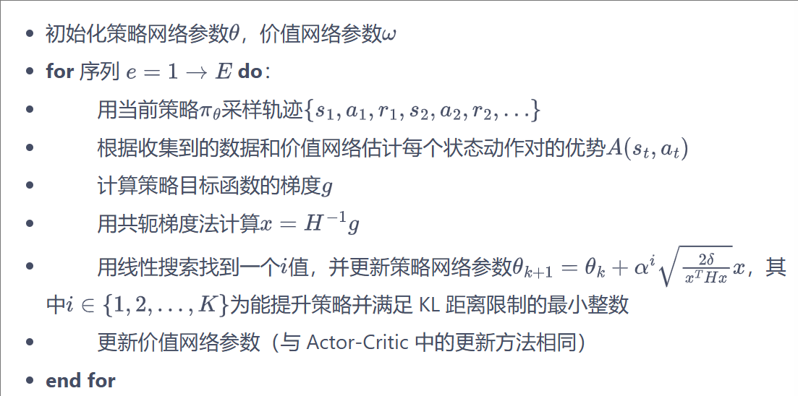


## Chapter 10 PPO

### 10.1 PPO-惩罚

用拉格朗日数乘法直接将KL散度的限制放进了目标函数中，从而变成了一个无约束的优化问题，在迭代的过程中不断更新KL散度前的系数：
$$
\arg\max_{\theta}\mathbb{E}_{s\sim\nu^{\pi_{\theta_k}}}\mathbb{E}_{a\sim\pi_{\theta_k}(\cdot|s)}\left[\frac{\pi_\theta(a|s)}{\pi_{\theta_k}(a|s)}A^{\pi_{\theta_k}}(s,a)-\beta D_{KL}[\pi_{\theta_k}(\cdot|s),\pi_\theta(\cdot|s)]\right]
$$
令$d_k=D_{KL}^{\nu^{\pi_{\theta_k}}}(\pi_{\theta_k},\pi_\theta)$，$\beta$(用于限制学习策略和之前一轮策略的差距)的更新规则如下：


### 10.2 PPO-截断

在目标函数中进行限制，以保证新的参数和旧的参数差距不会太大：
$$
\arg\max_{\theta}\mathbb{E}_{s\sim\nu}\mathbb{E}_{a\sim\pi_{\theta_k}(\cdot|s)}\left[\min\left(\frac{\pi_\theta(a|s)}{\pi_{\theta_k}(a|s)}A^{\pi_{\theta_k}}(s,a),\mathrm{clip}\left(\frac{\pi_\theta(a|s)}{\pi_{\theta_k}(a|s)},1-\epsilon,1+\epsilon\right)A^{\pi_{\theta_k}}(s,a)\right)\right]
$$
其中$\operatorname{clip}(x,l,r):=\max(\min(x,r),l)$ 将x限制在[l, r]内。上式中$\epsilon$是一个超参数，表示进行截断的范围

若$A^{\pi_{\theta_k}}(s,a)>0$，则这个动作的价值高于平均，最大化这个式子会增大$\frac{\pi_{\theta}(a|s)}{\pi_{\theta_{k}}(a|s)}$，但不会让其超过$1-\epsilon$；

若$A^{\pi_{\theta_k}}(s,a)<0$ ,则最大化这个式子会减小$\frac{\pi_{\theta}(a|s)}{\pi_{\theta_{k}}(a|s)}$，但不会让其超过$1-\epsilon$

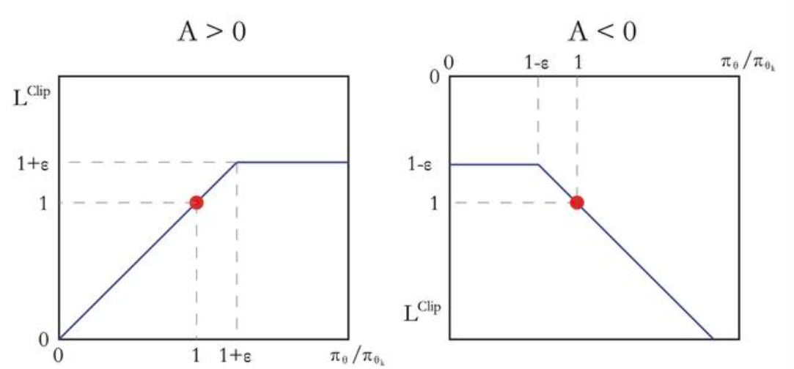


# Imitation Learning
