# Mobile Robots

[可视化Python](https://github.com/zhm-real/PathPlanning)

[MRPT](https://docs.mrpt.org/reference/latest/index.html)

[BorisVandermeer/DeepBlueCourses-PathingPlanning-Homework: 深蓝学院 - 高飞 - 运动规划课程作业](https://github.com/BorisVandermeer/DeepBlueCourses-PathingPlanning-Homework)

## Chapter 1 Mapping

### 1.1 structure


### 1.2 Occupancy grid map 

[grid map code](https://github.com/ANYbotics/grid_map)

* 原理：将平面地图通过grid进行分割，每个栅格用0,1表示（0 - free，1 - occupied）

  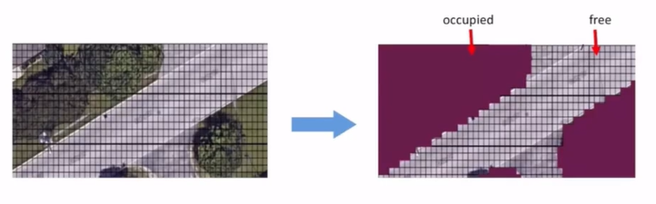

* Notation Defination

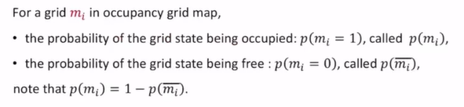


* Recursive Update

🙌推导：由贝叶斯公式：
$$
\begin{aligned}p(m_{i}|z_{1:t}) & =\frac{p(z_{t}|z_{1:t-1},m_{i})p(m_{i}|z_{1:t-1})}{p(z_{t}|z_{1:t-1})}\\  & \left(马尔科夫过程\right)=\frac{p(z_{t}|m_{i})p(m_{i}|z_{1:t-1})}{p(z_{t}|z_{1:t-1})}\\  & (贝叶斯展开)=\frac{p(m_{i}|z_{t})p(z_{t})}{p(m_{i})}\frac{p(m_{i}|z_{1:t-1})}{p(z_{t}|z_{1:t-1})}\end{aligned}
$$

$$
p(\overline{m_i}|z_{1:t})=\frac{p(\overline{m_i}|z_t)p(z_t)}{p(\overline{m_i})}\frac{p(\overline{m_i}|z_{1:t-1})}{p(z_t|z_{1:t-1})}
$$

 对上述两式相除，并取log：
$$
\log\frac{p(m_i|z_{1:t})}{p(\overline{m_i}|z_{1:t})}=\log\frac{p(m_i|z_t)}{p(\overline{m_i}|z_t)}\frac{p(\overline{m_i})}{p(m_i)}\frac{p(m_i|z_{1:t-1})}{p(\overline{m_i}|z_{1:t-1})}
$$
递归更新表达式：（化简log -> l）
$$
l_{t}(m_{i})=\log\frac{p(m_{i}|z_{t})}{p(\overline{m_{i}}|z_{t})}-l_0(m_i)+l_{t-1}(m_{i})
$$
其中，

P(z|m)是传感器模型 - 表示基于当前栅格状态得到当前观测值为0/1的概率

P(m|z)是逆传感器模型，为了约去它，做如下变换，并带入到递归更新表达式中：
$$
\begin{cases}p(m_i|z_t)=\frac{p(z_t|m_i)p(m_i)}{p(z_t)}\\p(\overline{m_i}|z_t)=\frac{p(z_t|\overline{m_i})p(\overline{m_i})}{p(z_t)}&\end{cases}
$$

$$
\log\frac{p(m_i|z_t)}{p(\overline{m_i|z_t})}=\log\frac{p(z_t|m_i)}{p(z_t|\overline{m_i})}+l_0(m_i)
$$

$$
✨l_t(m_i)=\log\frac{p(z_t|m_i)}{p(z_t|\overline{m_i})}+l_{t-1}(m_i)
$$

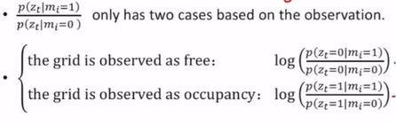

（由于上述两个值均是常量，因此✨看作是简单的加和运算）


🤔函数分析：
$$
l_t(m_i)=\log\frac{p(m_i|z_{1:t})}{p(\overline{m_i}|z_{1:t})}=\log\frac{p(m_i|z_{1:t})}{1-p(m_i|z_{1:t})}
$$


### 1.3 Octo map

[OctoMap code](https://github.com/OctoMap/octomap)


### 1.4 Voxel Hashing 

[VoxelHashing](https://github.com/niessner/VoxelHashing)


### 1.5 PointCloud Map


### 1.6 TSDF map(Truncated Signed Distance Function) 

* Code:

(1) [OpenChisel.](https://github.com/personalrobotics/OpenChisel)

(2) [tsdf-fusion-python](https://github.com/andyzeng/tsdf-fusion-python)


* 概述：一个三维的TSDF模型由 L×W×H 个三维小方块组成，这些三维小方块被称为体素(Voxel)。每个体素内包含两个变量，一是用于生成重建表面的**tsdf值**，二是用于重建表面贴纹理的**RGB值**。

​		转换物理坐标系到体素坐标系：$int ( ( x − x0 ) / voxel.x , ( y − y0 ) / voxel.y , ( z − z0 ) / voxel.z )$


* 计算步骤：
  

（1）**划分体素** 
a. 建立完全包围待重建物体的长方体包围盒  
b. 划分网络体素，对包围盒划分 n 等分  


（2）**TSDF 值计算**
a.TSDF 值的前身是 SDF 值：  
如下图，白灰色的小方格表示 TSDF 地图中的各个体素。蓝色的三角形表示相机的视场范围。图中间有一条绿色的截线，表示一个物体的截面。

     

b.计算$voxel$在**物理坐标**下的位置：  
记体素$x$在TSDF地图上的坐标 $(v_x, v_y, v_z)$, $x$在物理世界坐标系下的位置是：  
$$
P_{x,wrd} = \big(x_0 + v_x \cdot \mathrm{voxel.x},~ y_0 + v_y \cdot \mathrm{voxel.y},~ z_0 + v_z \cdot \mathrm{voxel.z}\big)
$$

c.计算体素$x$在**相机坐标**系下的位置：  

设相机相对于物理坐标系下的位姿是 \(R\) 和 \(T\)，体素 \(x\) 在相机坐标系下的位置是：  
$$
P_{x,cam} = \mathbf{R}P_{x,wrd} + T
$$

d.计算体素 $x$相对于**相机的深度** $cam_z(x)$：  

根据相机成像模型  
$$
\mathrm{cam}_z(x) \cdot I_x = \mathbf{K}P_{x,cam}
$$
   （$K$ 表示相机的内参数矩阵，$I_x$ 表示体素$x$投影在相机成像平面下的像素坐标）  

   沿着相机的光心和体素 \(x\) 作一条直线（图中深蓝色粗线），这条线会与**物体的截面**有一个交点，这个交点记为 \(P\) 点。\(P\) 点的深度记为 \(d_P\)。记当前的**深度图**为 \(D\)，在实际计算中取 \(d_P = D(I_x)\)。那么体素 \(x\) 的 SDF 值就可以计算出来：  
$$
\mathrm{sdf}(x) = d_P - d_x = D(I_x) - \mathrm{cam}_z(x)
$$

e. 计算 TSDF 值：  

   $sdf(x) > 0$表示体素 \(x\) 位于相机和物体表面之间；$sdf(x) < 0$表  示体素 $x$ 处于物体表面之后。  

   TSDF 计算公式如下：  
$$
\mathrm{tsdf}(x) = \max[-1, \min(1, \mathrm{sdf}(x) / t)]
$$

🤔**物理意义如下：**

$t$可以看作是**体素 $x$** 和**截面对应点 $P$ 深度**差值的阈值。当体素离表面非常近的时候，TSDF 值接近于零；当体素离表面非常远的时候，TSDF 值趋于 1 或者 -1。初始化时设所有体素的 TSDF 值为 1，相当于这个 TSDF 地图中没有任何表面。

（3）**当前帧与全局融合结果进行融合**
$$
\begin{aligned}&TSDF(p)=\frac{W(p)TSDF(p)+w(p)tsdf(p)}{W(p)+w(p)}\\&W(p)=W(p)+w(p)\end{aligned}
$$

​	


### 1.7 ESDF map 

* Code: 

(1) [FIESTA: Fast Incremental Euclidean Distance Fields for Online Motion Planning of Aerial Robots](https://github.com/HKUST-Aerial-Robotics/FIESTA)

(2) [voxblox: A library for flexible voxel-based mapping](https://github.com/ethz-asl/voxblox)

(3) [nvblox: A GPU-accelerated TSDF and ESDF library for robots equipped with RGB-D cameras.](https://github.com/nvidia-isaac/nvblox)

* Paper:                                                                                                                                                                                                                                                                                                                                                                                                                                                                                                                                                                                                      

(1) [Distance Transforms of Sampled Functions](https://cs.brown.edu/people/pfelzens/papers/dt-final.pdf)

(2) [Improved updating of Euclidean distance maps and Voronoi diagrams](https://ieeexplore.ieee.org/abstract/document/5650794)

(3) [nvblox](https://arxiv.org/pdf/2311.00626)

* 概念：

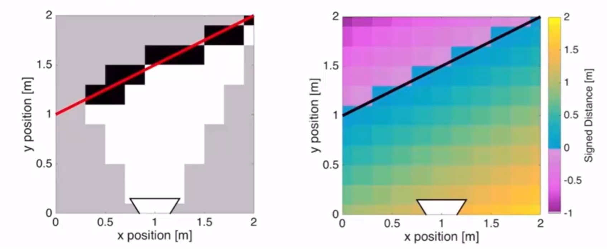

左：Occupancy 每个格子表示占据或空余

右：ESDF 每个格子表示到表面的欧氏距离

* 欧几里得距离变换(EDT)算法：

目标：**对于每一个点p，寻找一个障碍物点q离p点最近，其中f(q)看作是q点的消耗函数(是一个极小量)。**

(1) 一维情况：地图中点到栅格中障碍物的平方欧氏距离可以用二次函数表示。


$$
\mathcal{D}\left(p\right)=\min_{q\in\mathcal{G}}\{(p-q)^{2}+f(q)\}
$$
$\mathcal{D}\left(p\right)$ — 一维空间中的点p到障碍物的欧氏距离

${q\in\mathcal{G}}$ — 在栅格地图G中距离点p最近的障碍物q

f(q) — q的采样函数

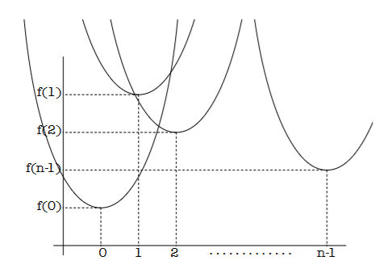

 $\mathcal{D}\left(p\right)$ — 距离函数可以看作是以(q, f(q))为最小值的抛物线，对于n个q点，即有n个以(q, f(q))为最小值的抛物线。

🤔核心思想：因此，对于属于[0, n-1]的p来说，其**EDT就是这些抛物线的下包络(lower envelop)。**


用k表示用来构成下包络的抛物线个数，v[k]表示第k个抛物线的顶点，z[k]和z[k+1]表示第k个抛物线在整个下包络中的有效范围，其中z[k]表示第k个抛物线与第k-1个抛物线的交点。

🙌讨论：假设一**顶点为q的新抛物线**与**原有下包络线最右侧抛物线v [ k ]**的交点为s，该交点的位置只存在两种可能：交点s在 z [ k ]左边或在z[ k ]右面。

任意两个抛物线有且仅有一个交点，其在一维坐标轴的投影位置s计算如下：
$$
s=\frac{(f(r)+r^2)-(f(q)+q^2)}{2r-2q}
$$
现对z[k]和s的位置进行讨论：

a. 若交点 s 在 z [ k ] 右边，即 s > z [ k ] ，则将抛物线 q 添加为下包络最右边的抛物线，有k = k + 1 ，v [ k ] = q，z [ k ] = s，z [ k + 1 ] = + ∞ 

b. 若交点 s 在 z [ k ]  左边，即 s < z [ k ] ，则**将下包络原有的抛物线 v [ k ] 删除，并有k = k − 1** (此处用来保证该交点永远是最小值)，然后重新计算抛物线q与下包络此时最右侧的抛物线 v [ k ]的交点 s ，并重复上述过程，直到交点 s 在 z [ k ]右边。

✨算法：

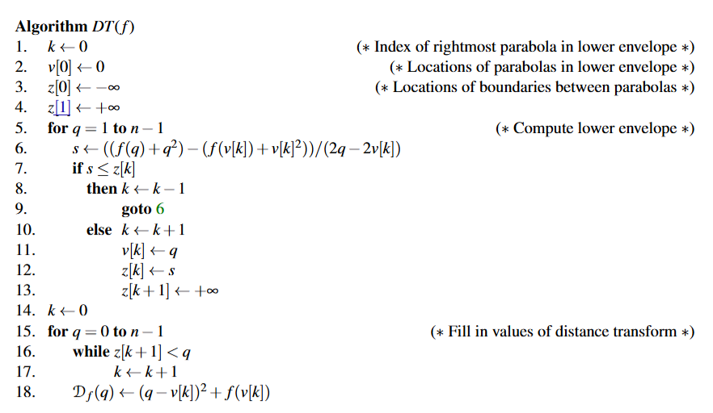

```c++
//one dimension
template <typename F_get_val, typename F_set_val>
void SDFMap::fillESDF(F_get_val f_get_val, F_set_val f_set_val, int start, int end, int dim) {
  int v[mp_.map_voxel_num_(dim)];
  double z[mp_.map_voxel_num_(dim) + 1];

  int k = start;
  v[start] = start;
  z[start] = -std::numeric_limits<double>::max();
  z[start + 1] = std::numeric_limits<double>::max();

  for (int q = start + 1; q <= end; q++) {
    k++;
    double s;

    do {
      k--;
      s = ((f_get_val(q) + q * q) - (f_get_val(v[k]) + v[k] * v[k])) / (2 * q - 2 * v[k]);
    } while (s <= z[k]);

    k++;

    v[k] = q;
    z[k] = s;
    z[k + 1] = std::numeric_limits<double>::max();
  }

  k = start;

  for (int q = start; q <= end; q++) {
    while (z[k + 1] < q) k++;
    double val = (q - v[k]) * (q - v[k]) + f_get_val(v[k]);
    f_set_val(q, val);
  }
}

```


(2) 二维情况：

对于$\mathcal{G}=\{0,\ldots,n-1\}\times\{0,\ldots,m-1\}$二维栅格，欧氏距离平方变换为：
$$
D_f(x,y)=\min_{x^{\prime},y^{\prime}}\left((x-x^{\prime})^2+(y-y^{\prime})^2+f(x^{\prime},y^{\prime})\right)
$$
化简为：

(其中$\mathcal{D}_{f|_{x^{\prime}}}(y)$是f被限定在列为x'的一维距离变换，(x', y')为障碍物的坐标)
$$
\begin{aligned}D_{f}(x,y)&=\min_{x^{\prime}}\left\{(x-x^{\prime})^{2}+\min_{y^{\prime}}\{(y-y^{\prime})^{2}\}\right\}\\&=\min_{x^{\prime}}\{(x-x^{\prime})^{2}+\mathcal{D}_{f|x^{\prime}}(x^{\prime},y)\}\end{aligned}
$$
先计算每一列的纵向EDT：x固定，格子中表示该点距离该列障碍物的距离f(x')，无穷表示该列没有障碍物。

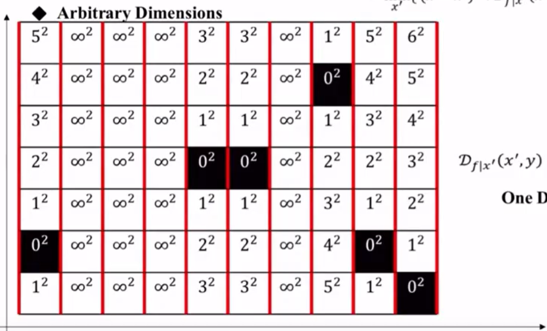

再计算每一行的EDT：固定y坐标，即可将二维问题先转换为一维情况—寻找x'使得D(x)min。
$$
\mathcal{D}(x)=\operatorname*{min}_{x^{\prime}}\{(x-x^{\prime})^{2}+f(x^{\prime})\}
$$
eg:选中x=1,y=1，依次代入到上式中，注意x'为这一行别的格子


最终结果如下：

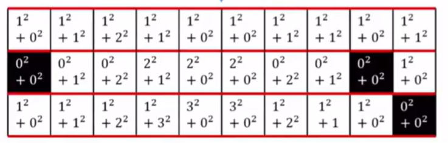

挑选第一行画出坐标，可见网格中值即对应下包络的纵坐标


```c++
//two dimensions
void SDFMap::updateESDF3d() {
  Eigen::Vector3i min_esdf = md_.local_bound_min_;
  Eigen::Vector3i max_esdf = md_.local_bound_max_;

  /* ========== compute positive DT ========== */

  for (int x = min_esdf[0]; x <= max_esdf[0]; x++) {
    for (int y = min_esdf[1]; y <= max_esdf[1]; y++) {
      fillESDF(
          [&](int z) {
            return md_.occupancy_buffer_inflate_[toAddress(x, y, z)] == 1 ?
                0 :
                std::numeric_limits<double>::max();
          },
          [&](int z, double val) { md_.tmp_buffer1_[toAddress(x, y, z)] = val; }, min_esdf[2],
          max_esdf[2], 2);
    }
  }

  for (int x = min_esdf[0]; x <= max_esdf[0]; x++) {
    for (int z = min_esdf[2]; z <= max_esdf[2]; z++) {
       //md_.tmp_buffer1_是上一维度计算的结果，作为本维度计算的基础赋给 f(q) 
      fillESDF([&](int y) { return md_.tmp_buffer1_[toAddress(x, y, z)]; },
               [&](int y, double val) { md_.tmp_buffer2_[toAddress(x, y, z)] = val; }, min_esdf[1],
               max_esdf[1], 1);  
    }
  }

  for (int y = min_esdf[1]; y <= max_esdf[1]; y++) {
    for (int z = min_esdf[2]; z <= max_esdf[2]; z++) {
       //md_.tmp_buffer2_是上一维度计算的结果，作为本维度计算的基础赋给 f(q) 
      fillESDF([&](int x) { return md_.tmp_buffer2_[toAddress(x, y, z)]; },
               [&](int x, double val) {
               md_.distance_buffer_[toAddress(x, y, z)] = mp_.resolution_ * std::sqrt(val);
                 //  min(mp_.resolution_ * std::sqrt(val),
                 //      md_.distance_buffer_[toAddress(x, y, z)]);
               },
               min_esdf[0], max_esdf[0], 0);
    }
  }

  /* ========== compute negative distance ========== */
  for (int x = min_esdf(0); x <= max_esdf(0); ++x)
    for (int y = min_esdf(1); y <= max_esdf(1); ++y)
      for (int z = min_esdf(2); z <= max_esdf(2); ++z) {

        int idx = toAddress(x, y, z);
        if (md_.occupancy_buffer_inflate_[idx] == 0) {
          md_.occupancy_buffer_neg[idx] = 1;

        } else if (md_.occupancy_buffer_inflate_[idx] == 1) {
          md_.occupancy_buffer_neg[idx] = 0;
        } else {
          ROS_ERROR("what?");
        }
      }

  ros::Time t1, t2;

  for (int x = min_esdf[0]; x <= max_esdf[0]; x++) {
    for (int y = min_esdf[1]; y <= max_esdf[1]; y++) {
      fillESDF(
          [&](int z) {
            return md_.occupancy_buffer_neg[x * mp_.map_voxel_num_(1) * mp_.map_voxel_num_(2) +
                                            y * mp_.map_voxel_num_(2) + z] == 1 ?
                0 :
                std::numeric_limits<double>::max();
          },
          [&](int z, double val) { md_.tmp_buffer1_[toAddress(x, y, z)] = val; }, min_esdf[2],
          max_esdf[2], 2);
    }
  }

  for (int x = min_esdf[0]; x <= max_esdf[0]; x++) {
    for (int z = min_esdf[2]; z <= max_esdf[2]; z++) {
      fillESDF([&](int y) { return md_.tmp_buffer1_[toAddress(x, y, z)]; },
               [&](int y, double val) { md_.tmp_buffer2_[toAddress(x, y, z)] = val; }, min_esdf[1],
               max_esdf[1], 1);
    }
  }

  for (int y = min_esdf[1]; y <= max_esdf[1]; y++) {
    for (int z = min_esdf[2]; z <= max_esdf[2]; z++) {
      fillESDF([&](int x) { return md_.tmp_buffer2_[toAddress(x, y, z)]; },
               [&](int x, double val) {
                 md_.distance_buffer_neg_[toAddress(x, y, z)] = mp_.resolution_ * std::sqrt(val);
               },
               min_esdf[0], max_esdf[0], 0);
    }
  }

  /* ========== combine pos and neg DT ========== */
  for (int x = min_esdf(0); x <= max_esdf(0); ++x)
    for (int y = min_esdf(1); y <= max_esdf(1); ++y)
      for (int z = min_esdf(2); z <= max_esdf(2); ++z) {

        int idx = toAddress(x, y, z);
        md_.distance_buffer_all_[idx] = md_.distance_buffer_[idx];

        if (md_.distance_buffer_neg_[idx] > 0.0)
          md_.distance_buffer_all_[idx] += (-md_.distance_buffer_neg_[idx] + mp_.resolution_);
      }
}
```


## Chapter 2 Path Finding

[PathFinding可视化](https://qiao.github.io/PathFinding.js/visual/)

### 2.1 Search-based Method

#### 1. Graph Search Basic：

(1) 状态空间图：

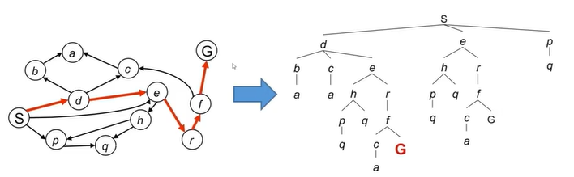

(2) 图搜索算法框架：

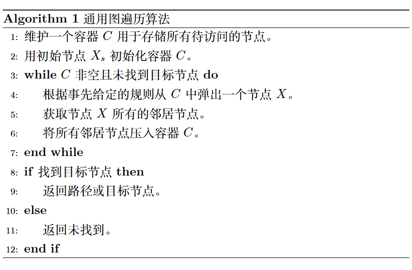

**其中第四步就是算法核心，BFS、DFS**


#### 2. BFS＆DFS

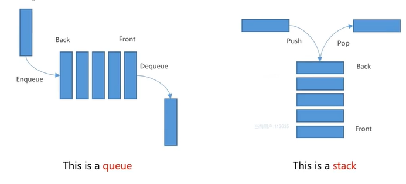

(1) BFS：先进先出(队列)

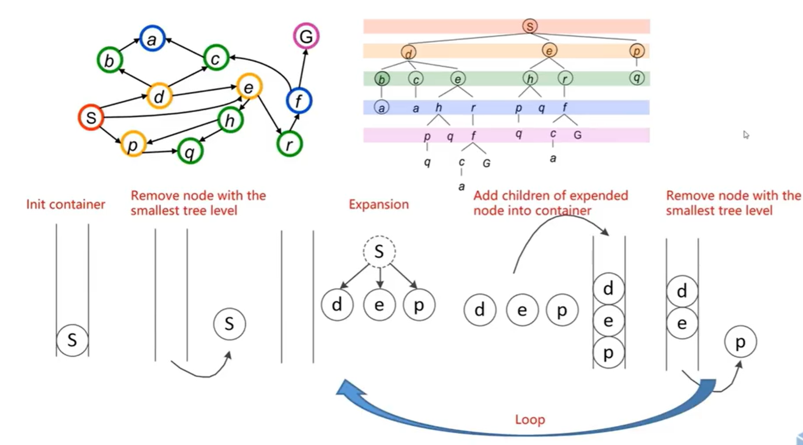


(2) DFS：后进先出(堆栈)

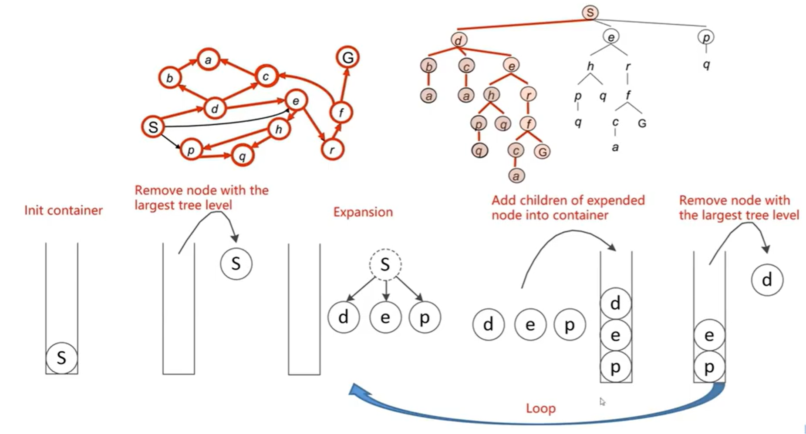


(3) **BFS用于图搜索算法**

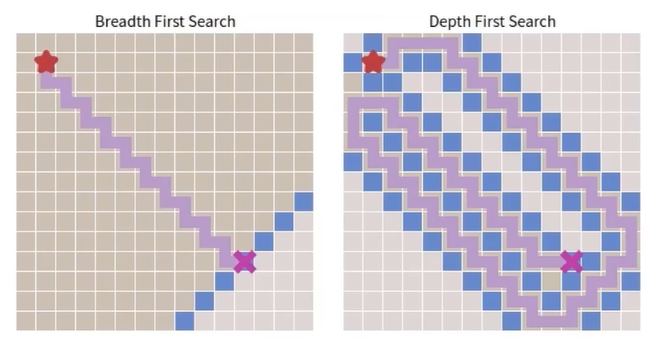


#### 3. Heuristic Search - 启发式搜索算法（贪心算法）

(1) 介绍

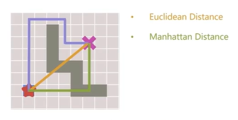

(2) 有无障碍物对比

无障碍物：GBFS更优（因为优先找到最短路径）

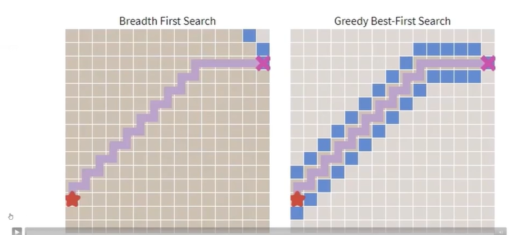

有障碍物：BFS能找到全局最优

贪心算法容易陷入局部最优（容易忽略障碍物）

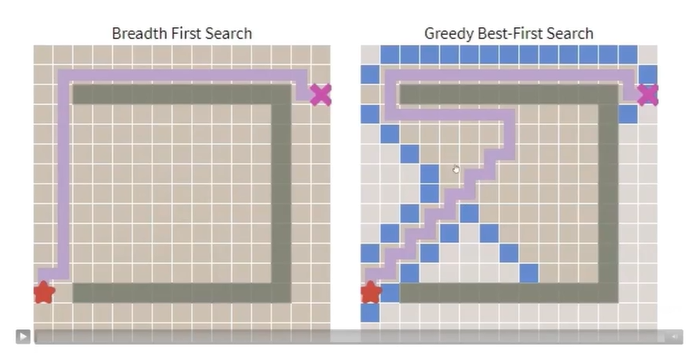


#### 4. Dijkstra ＆ A*

(1) Dijkstra:

priority queue: 可以将队列内节点**自动**按照代价g(n)进行排序


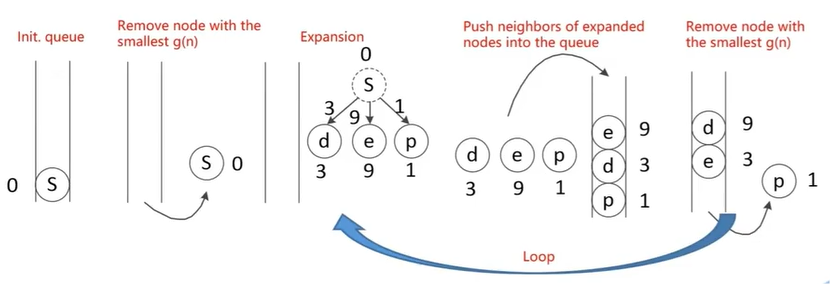

Pros:完整的优化路径搜索

Cons: 只能看到当前的累计代价，因此会向周围各个方向拓展；不知道终点的位置


(2) A* (Dijkstra + 贪心)

g(n) : 从初始节点到当前节点n的最小累计代价。

启发函数 h(n) : 从当前节点n到终点的最小估计代价。

设计：当启发函数h(n)  <  实际上从n到终点的代价h*(n)


=> f(n) : 从初始节点到终点的最小估计代价。
$$
\mathrm{f(n)=g(n)+h(n)}
$$


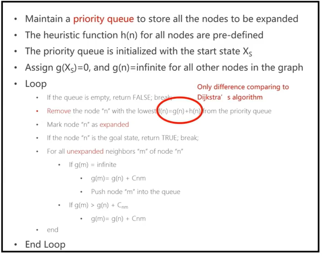

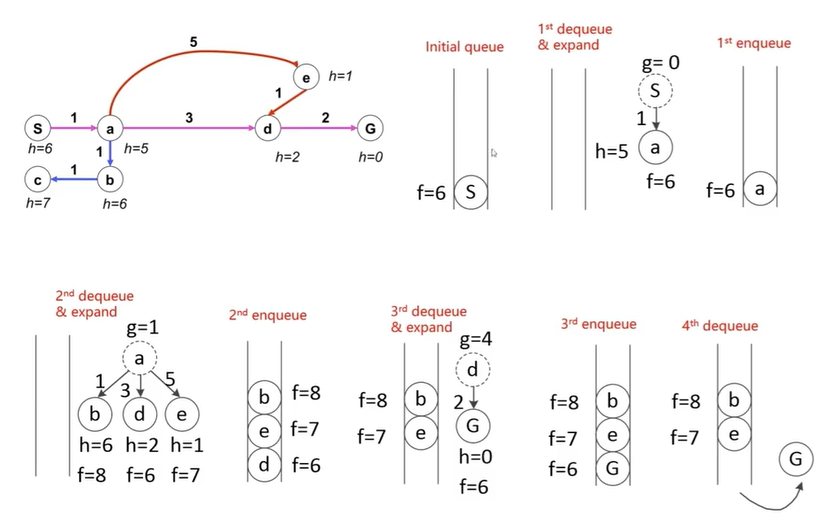


(3) D*

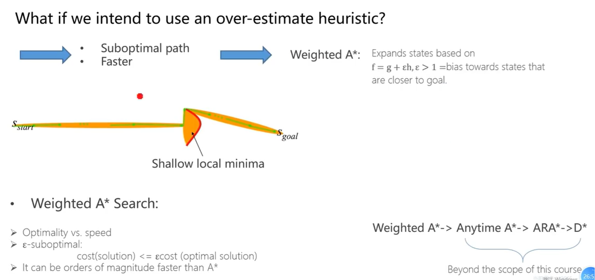

 

#### 5. Grid-based Path Search

(1) 栅格地图到连接图的转换

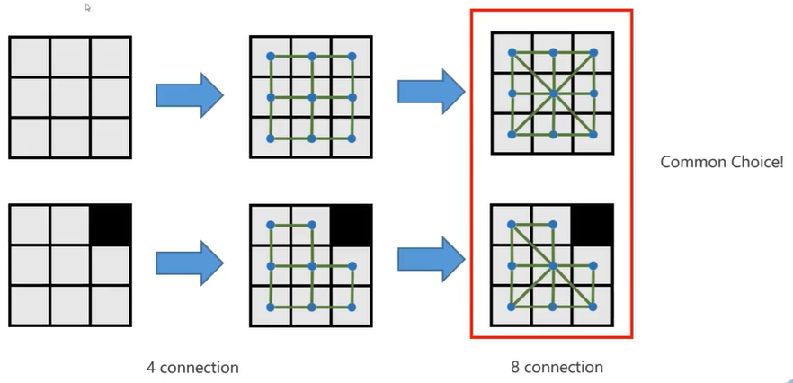


#### 6. Jump Point Search

(1) 概念：

**路径权值**：和A*中f = g + h相同

**强迫邻居**：**节点 x 的8个邻居中有障碍**，且 x 的父节点 p 经过x 到达 n 的距离代价比不经过 x 到达的 n 的任意路径的距离**代价小**，则称 n 是 x 的强迫邻居。


* 横向判断：

如下图（7，10）为起点，向右进行横向搜索。当搜索到（9，10）时，检测到（9，11）是障碍点，（10，11）是可行走点，因此（9，10）会被认定为跳跃点，而（10，11）是（9，10）的强迫邻居。

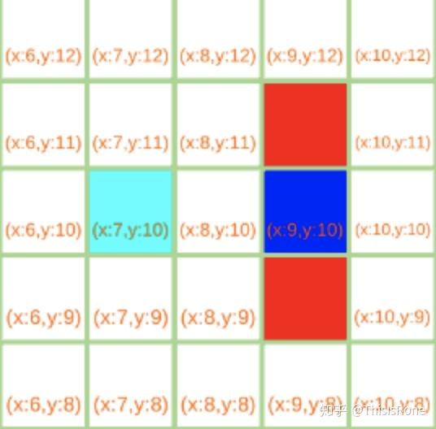

* 对角搜索：

（7，10）是搜索起点，对右下角的（8，9）进行判断：（8，9）左侧（7，9）是障碍

点且（8，8）是可行走点的情况下，若（7，8）是可行走点，则认为（7，8）就是强迫

邻居。

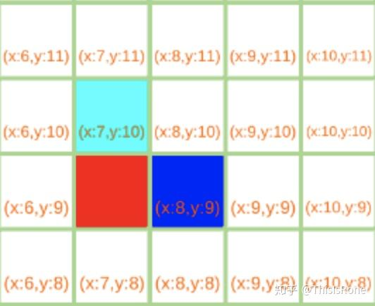


**跳跃点**：在路径上改变移动方向的点

* 节点A是起点、终点
* 节点A至少有一个强迫邻居
* 父节点在斜方向（斜向搜索），节点A的水平或者垂直方向上有满足上述两点的节点

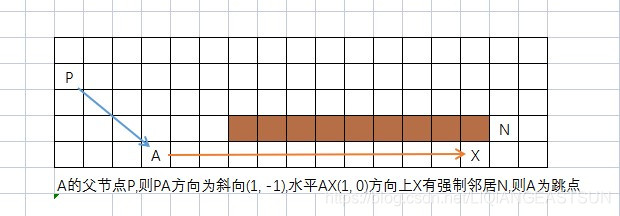


**跳跃规则**：水平、横向与对角线方向扩展搜索；当遇到障碍物时停止跳跃；**轨迹只能为对角方向！！！**

* 横向跳跃：y是x的跳跃点

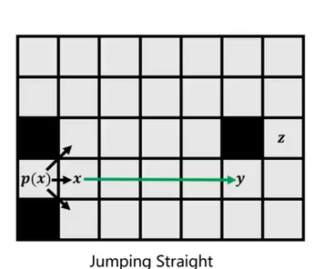

* 对角跳跃：y是x的跳跃点

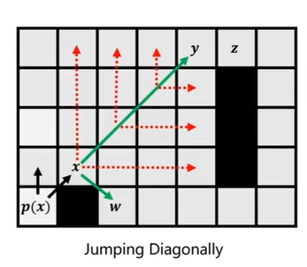

* 跳跃例程：黄色 - 当前搜索节点；紫色 - 跳跃点；蓝色 - 强迫邻居

对于绿色节点，搜索到黄色点时，发现横向有**跳跃点**；将黄色节点放入到**openlist**中，绿色节点放入closelist中。


对于黄色节点，再进行对角方向拓展，发现无法拓展，则将黄色节点加入close list。

将紫色点加入open list。


对于黄色节点，水平和垂直搜索均有障碍物，对角搜索发现紫色节点，且其垂直方向即为目标点，则完成对黄色节点的拓展，加入close list。

将紫色节点加入open list。

✨ **邻接点为目标点等同于强迫邻居**


对于黄色节点，垂直方向拓展找到目标点，搜索结束！


(2)  算法步骤：


(3) 实例：

* 如下图所示，绿色为起点，红色为终点，黑色为障碍物

开始将S加入open list；从open list中取出权值最小的节点S；

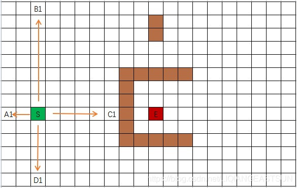

* 


* 

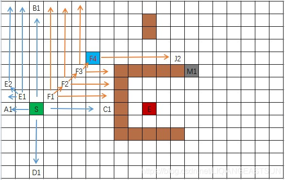


(4) 对比：


### 2.2 Sampling-based Method

#### 1. Feasible methods(PRM, RRT)

(1) PRM

a. Learning Phase：构建连接图，近似表示机器人的运动轨迹

* 随机采样节点（均匀随机采样/根据密度采样）：在配置空间中随机生成大量的配置点；对每个配置点进行碰撞检测（机器人是否会与障碍物发生碰撞），将无碰撞点添加到路线图的节点集合V中。
* 连接节点：对于每个节点q，算法寻找他的邻居节点（K近邻-选择与q距离最近的k个节点，距离预支-选择所有与q的距离小于某个设定阈值Dmax的节点）；对于每对邻居节点(q, q')，使用局部规划器检查两点之间的路径是否完全无碰撞；若找到一条无碰撞路径，则在路线图的边几何E中添加一条连接q和q'的边。

* 构建图：重复上述操作，直到覆盖大部分自由空间或达到预设采样次数或时间。


b. Query Phase：回答从起始配置到目标配置的路径规划请求。

* 连接起始点和目标点到路线图：给定一个起始配置$q_{start}$和一个目标配置 

  $q_{goal}$；使用局部规划器尝试将 $q_{start}$连接到路线图中其最近的若干个节点；

  同样地，尝试将$q_{goal}$连接到路线图中其最近的若干个节点；如果连接成功，

  则将这些连接作为新的边添加到路线图中。

* **图搜索**：在已构建好路线图的完整图上，使用标准的图搜索算法（Dijkstra或A*）来寻找从$q_{start}到$$q_{goal}$的最短路径；若找到一条路径，则其节点序列就构成了从起始点到目标点的一条无碰撞路径。


c. 改进措施：

* Lazy PRM：延迟碰撞检测，只在图搜索到某条路径才对路径上的边进行碰撞检测，从而减少计算量。


(2) RRT

[全局路径规划：图搜索算法介绍4(RRT/RRT*)_双向rrt算法-CSDN博客](https://blog.csdn.net/gophae/article/details/103231053)

1. 初始化整个空间，定义初始点、终点、采样点数、点与点之间的步长t等信息

2. 在空间中随机产生一个点xrand

3. 在已知树的点集合中找到距离这个随机点最近的点xnear

4. 在xnear到xrand的直线方向上从xnear以步长t截取点xnew

   

5. 判断从xnear到xnew之间是否存在障碍物，若存在则舍弃该点

   

6. 将new点加入到树集合中

7. 循环2~6，循环结束条件：有一个new点在终点的设定邻域内

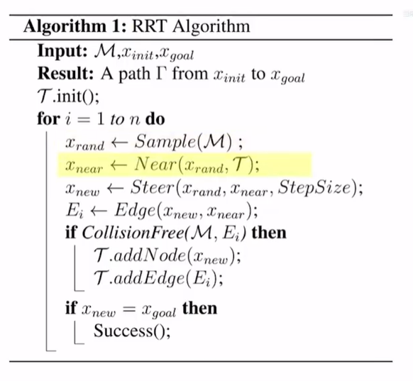


#### 2. Optimal methods(RRT*)

(1) 算法

**每个节点增加一个属性distance_to_start，用于存储其到出发点的距离。**

**每个节点选择父节点的时候，新节点的距离等于父节点的距离加上父节点到子节点的直线距离。**

1. 初始化整个空间，定义初始点、终点、采样点数、点与点之间的步长t等信息

2. 在空间中随机产生一个点x_rand

3. 在已知树的点集合中找到距离这个随机点最近的点x_near

4. 在x_near到x_rand的直线方向上从x_near以步长t截取点x_new(PS:x_near和x_new不会连接起来)

5. 判断从x_near到x_new之间是否存在障碍物，若存在则舍弃该点

6. rewrite: x_new加入树中后，重新选择父节点X_near，使其到起始点的代价更小

   * 以x_new为半径搜索较近的可能父节点X_near

   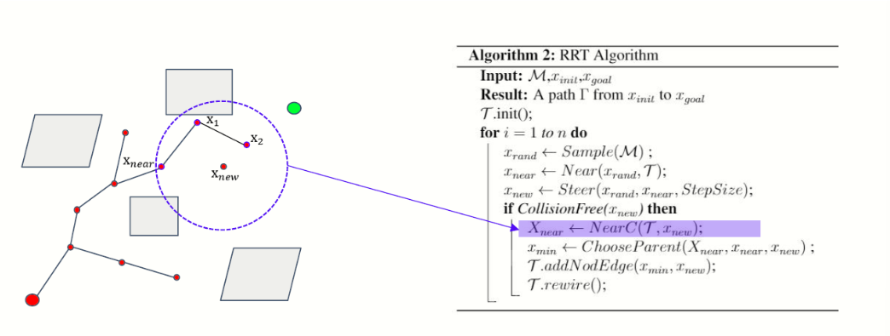

   * 查看哪个节点到达start最短。图中new-near-start是最短的，new-x1-near-start和new-x2-near-start均比第一条路长。

   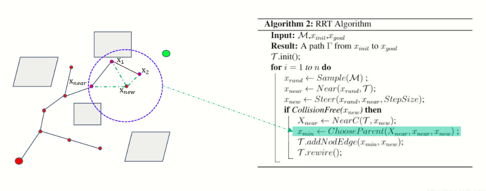

   * 添加点到集合中

   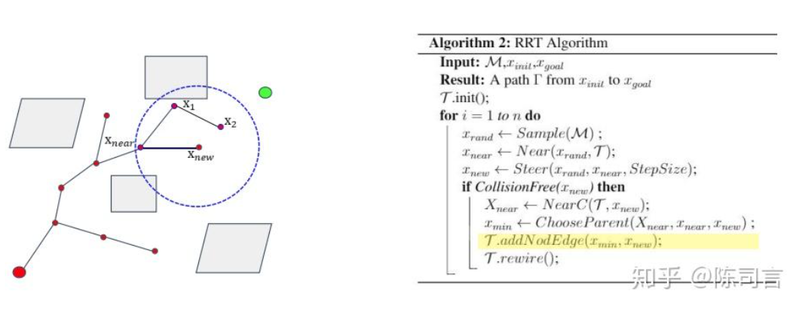

7. random relink: 对新节点x_new附近一定范围内的节点进行重连。重连就是，检查一下如果把x_new附近的这些节点的父节点设置为x_new，这些节点的代价会不会减小。如果能够减小，就把这些节点的父节点更改为x_new；否则，就不更改。

   * 对x1来说，start-near-x1比start-near-new-x1的距离短，所以x1的父节点是near，不用修改。

   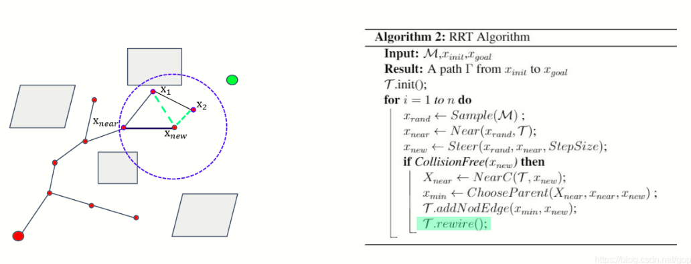

   * 对于x2来说，start-near-x1-x2比start-near-new-x2的距离长，所以修改x2的父节点为new。

   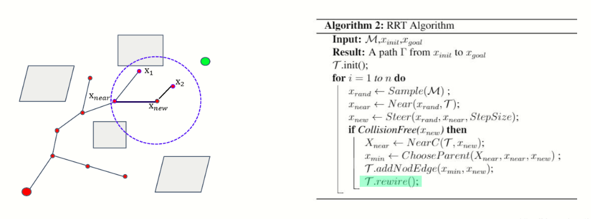

8. 循环2~7，循环结束条件：有一个new点在终点的设定邻域内


#### 3. Accelerate convergence(RRT#, Informed RRT*, GuiLD)


### 2.3


## Chapter 2 


# Autonomus Cars
