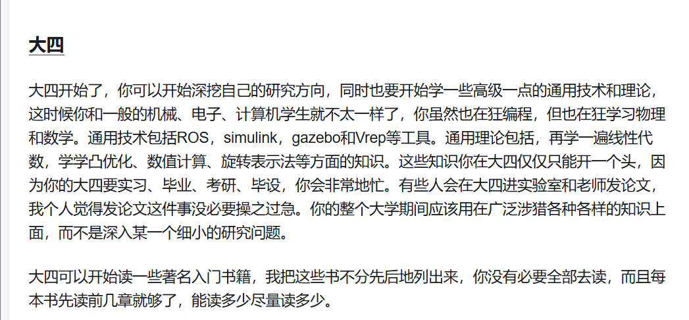
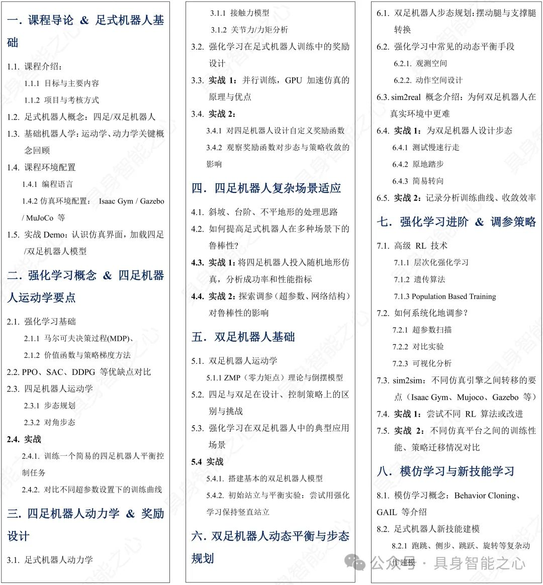
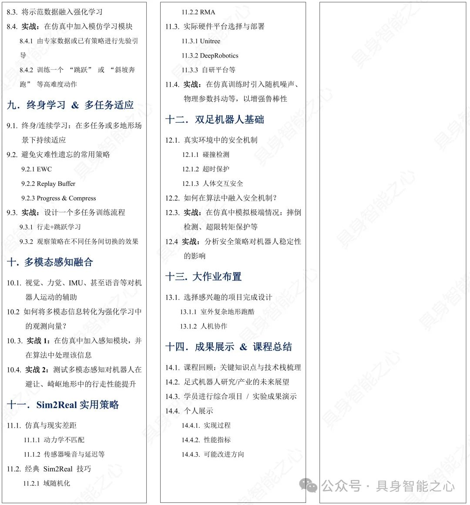

# Robot Learning Note

**Here are some links of  some course and paper lists about some awesome robotics algorithms**

https://zhuanlan.zhihu.com/p/340344248

[Robots | Papers With Code](https://paperswithcode.com/area/robots)

 [‬⁠‬‬‌‍‌‍‬‌‍⁠⁠‬‍⁠‬⁠全网最全具身智能知识库 - 飞书云文档](https://yv6uc1awtjc.feishu.cn/wiki/WPTzw9ON0ivIVrkLjVocNZh8nLf)

机器人工程师学习计划 - YY硕的文章 - 知乎
https://zhuanlan.zhihu.com/p/22266788

### 1、Robotics Basic：

姿态表示和转换（欧拉角、四元数、旋转矩阵、SO3）

机器人正逆运动学(林佩群 台大)

[6.1机械臂轨迹规划-1_哔哩哔哩_bilibili](https://www.bilibili.com/video/BV1oa4y1v7TY?spm_id_from=333.788.player.switch&vd_source=41ecf2720f0aef9d6e7aadbcb46c655f&p=6)

四轮车运动学

[【自动驾驶】总目录（持续更新）_自动驾驶归档清单-CSDN博客](https://blog.csdn.net/weixin_42301220/article/details/124832403)

### 2、Perception＆Localization

(1) Autonomous driving perception: 

[Apollo开发者社区_Apollo精品课](https://apollo.baidu.com/community/online-course)

a. 3D-Lidar(PointCloud): Object detection, semantic segmentation, occupancy predection, end2end, word model

[自动驾驶环境感知 - 深蓝学院 - 专注人工智能与自动驾驶的学习平台](https://www.shenlanxueyuan.com/course/622)

b. BEV:  BEVDet, BEVFusion, Occupancy Network

[BEV感知理论与实践 - 深蓝学院 - 专注人工智能与自动驾驶的学习平台](https://www.shenlanxueyuan.com/course/752)

(2) Slam:

visual slam, orb slam, FAST-LIVO2

[自动驾驶与机器人中的SLAM技术 - 深蓝学院 - 专注人工智能与自动驾驶的学习平台](https://www.shenlanxueyuan.com/course/650?source=1)

amcl

(3)Learning-based methods...

VLN

[SLAM如何与具身导航结合？](https://mp.weixin.qq.com/s/HUbGJU8-EWjV8-8LiblNeA)

### 3、[Motion Planning](Motion%20Planning.md)

(1)Path finding:

a.Search-based: 

A*, Dijkstra, JPS

b.Sampling-based: 

RRT, RRT*, Informed RRT *, DWA, PRM(Probability Roadmap)

c.Kinodynamic: 

State Lattice Search、Kinodynamic RRT* , Hybrid A*

[移动机器人运动规划-第三章(基于采样的路径规划)-第一节(feasible path planning methods)_哔哩哔哩_bilibili](https://www.bilibili.com/video/BV1ZHPueWE4U?spm_id_from=333.788.player.switch&vd_source=41ecf2720f0aef9d6e7aadbcb46c655f)

(2)Trajectory/Mapping:

fast planner、ego planner

Navigation

(3)Autonomus:

[自动驾驶控制与规划 - 深蓝学院 - 专注人工智能与自动驾驶的学习平台](https://www.shenlanxueyuan.com/course/479?source=1)

(4)Learning-based methods

VLN

[复旦大学视觉语言导航研究重磅调研（后附下载链接）！](https://mp.weixin.qq.com/s/PgsLQ_GKdyN9-D2_zVx0rg)

### 4、Control(C++)：

(1)Model-based control: (autonomus driving)

PID、MPC、LQR

卡尔曼滤波

(2)Optimal control: 

动态规划， 变分法， 极大值原理

Optimal Control 

[Optimal Control (CMU 16-745) 2024 Lecture 1: Intro and Dynamics Review](https://www.youtube.com/watch?v=Kj88Nory8ec&list=PLZnJoM76RM6Jv4f7E7RnzW4rijTUTPI4u)[CMU最优控制16-745超详细学习笔记 - 知乎](https://zhuanlan.zhihu.com/p/629131647)

[Optimal-Control-16-745/lecture-notebooks-2023](https://github.com/Optimal-Control-16-745/lecture-notebooks-2023)

### 5、[Reinforcement Learning](Reinforcement%20Learning.md)

(1)Classic algorithms: 

RLHF、PPO、DPO

(2)Imitation Learning: 

Diffusion policy、ACT、RT、RDT、GR

(3)DRL:

[P3. Python学习中的两大法宝函数（当然也可以用在PyTorch）_哔哩哔哩_bilibili](https://www.bilibili.com/video/BV1hE411t7RN/?spm_id_from=333.788.videopod.episodes&vd_source=41ecf2720f0aef9d6e7aadbcb46c655f&p=4)

### 6. Simulator：

[CS331B](https://web.stanford.edu/class/cs331b/)

[CS 294-277, Robots That Learn (Fall 2024)](https://robots-that-learn.github.io/)

(1) Mujoco

[Albusgive/mujoco_learning](https://github.com/Albusgive/mujoco_learning)

(2) Isaac Sim/Lab

[OpenUSD](https://www.nvidia.com/en-us/learn/learning-path/openusd/)

(3) Gazebo

### 7. RobotArm + VLM：

VLA, Open-VLA, pi0, rdt, peract2, RT-1

[ICLR2025 GenBot](https://genbot-workshop.github.io/)

[微信公众平台](https://mp.weixin.qq.com/s?__biz=MzkyMTc1NTI3Ng==&mid=2247488481&idx=1&sn=32e7f13c00e77cd1554d2ae5747cb742&chksm=c0286604c5bc2a20aef8a26456fb5b6782e76a83f4ce3212cebbd2aae2d8a4134913039abaee&mpshare=1&scene=1&srcid=0605Blxapj7bmQuEbZueHzeS&sharer_shareinfo=ea47b0041967cbe6790c5f9a974751d1&sharer_shareinfo_first=ea47b0041967cbe6790c5f9a974751d1#rd)

### 8. Humanoid Robot

[人形机器人+RL 论文汇总 - 知乎](https://zhuanlan.zhihu.com/p/674122347)

[资源中心 - 具身智能社群](https://www.unifolm.com/#/resource)

[RL做足式机器人运控的经典必读文章（带私货） - 知乎](https://zhuanlan.zhihu.com/p/29806809248)

[人形机器人系统：理论与实践 - 深蓝学院 - 专注人工智能与自动驾驶的学习平台](https://www.shenlanxueyuan.com/course/773?source=1)

### 9. Legged Robot

[足式机器人运动控制 - 深蓝学院 - 专注人工智能与自动驾驶的学习平台](https://www.shenlanxueyuan.com/course/770)
