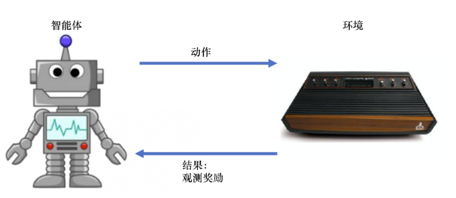
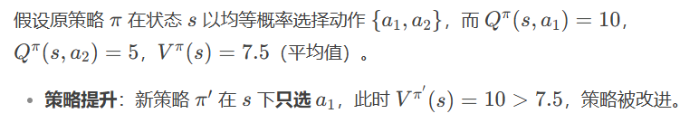

## Reinforcement Learning

[Python3 面向对象 | 菜鸟教程](https://www.runoob.com/python3/python3-class.html)

[蘑菇书EasyRL](https://datawhalechina.github.io/easy-rl/#/)

## Chapter 1 Intro




1.1奖励

由环境给的一种标量的反馈信号（scalar feedback signal），这种信号可显示智能体在某一步采取某个策略的表现如何。强化学习的目的就是最大化智能体可以获得的奖励，智能体在环境里面存在的目 的就是最大化它的期望的累积奖励（expected cumulative reward）。


1.2 智能体组成部分

- **策略（policy）**：将输入的状态变成可能采取的动作的概率，通常采用随机策略，在学习时可以通过引入一定的随机性来更好地探索环境。

**随机性策略（π函数）**：$\pi(a|s)=p\left(a_{t}=a|s_{t}=s\right)$输入状态s，输出智能体所有动作得概率。

**确定性策略**： 智能体直接采取最有可能的动作，$a^*=\arg\max_a\pi(a\mid s)$


- **价值函数（value function）**。我们用价值函数来对当前状态进行评估。价值函数用于评估智能体进 入某个状态后，可以对后面的奖励带来多大的影响。价值函数值越大，说明智能体进入这个状态越有利。

  ​

- **模型（model）**。模型表示智能体对环境的状态进行理解，它决定了环境中世界的运行方式。 

  ​


1.3 智能体类型

* **基于价值的智能体**：显式地学习价值函数，隐式地学习它的策略。策略是其从学到的价值函数里面推算出来的（Q-learning/Sarsa）


* **基于策略的智能体**：直接学习策略，我们给它一个状态，它就会输出对应动作的概率。（Policy Gradient/PG）

  ​

```python
import gymnasium as gym

#创建一个env 参数包括场景类型、渲染模式
env = gym.make("LunarLander-v3", render_mode="human")
observation, info = env.reset()

#首先设置eposode_over为flase，进入训练循环
episode_over = False
while not episode_over:
    action = env.action_space.sample()  # agent policy that uses the observation and info
    observation, reward, terminated, truncated, info = env.step(action) #智能体执行动作，智能体从更新后的环境接收到新的观测以及执行动作的奖励；

    episode_over = terminated or truncated

env.close()
```


## Chapter 2 Markov decision process(MDP)

### 2.1马尔科夫过程

1、随机过程：

已知历史信息（S1, ..., St）时下一个时刻状态为St+1的概率表示成$P(S_{t+1}|S_1,\ldots,S_t)$

2、马尔科夫性质：（**状态转移**）

当且仅当某时刻的状态只取决于上一时刻的状态时$P(S_{t+1}|S_t)=P(S_{t+1}|S_1,\ldots,S_t)$

3、马尔科夫链：<S, P>

n个状态：S = {S1, S2, ... , Sn}

状态转移矩阵P：$\mathcal{P}=\begin{bmatrix}P(s_1|s_1)&\cdots&P(s_n|s_1)\\\vdots&\ddots&\vdots\\P(s_1|s_n)&\cdots&P(s_n|s_n)\end{bmatrix}$  （每一行和为1）


### 2.2马尔科夫奖励过程（MRP）

1. 马尔科夫奖励过程：

$\langle\mathcal{s},\mathcal{P},r,\gamma\rangle$

* $\mathcal{s}$是有限状态的集合。

* $\mathcal{P}$是状态转移矩阵。

* $r$是奖励函数，**某个状态$s$的奖励 $r(s)$指转移到该状态时可以获得奖励的期望**。

* $\gamma$是折扣因子 (discount factor), $\gamma$的取值范围为[0,1)。引入折扣因子的理由为远期利益具有一定不确定性，有时我们更希望能够尽快获得一些奖励，所以我们需要对远期利益打一些折扣。接近 1 的γ更关注长期的累计奖励，接近 0 的γ更考虑短期奖励。

  ​


#### 2. 回报：

在一个马尔可夫奖励过程中，从第t时刻状态开始，直到终止状态时，所有奖励的衰减之和称为**回报**Gt（Return）

$$G_t=r_t+\gamma r_{t+1}+\gamma^2r_{t+2}+\cdots=\sum_{k=0}^\infty\gamma^kr_{t+k}$$

其中**r_t表示在t时刻获得的奖励**

```python 
import numpy as np
np.random.seed(0)
# 定义状态转移概率矩阵P
P = [
    [0.9, 0.1, 0.0, 0.0, 0.0, 0.0],
    [0.5, 0.0, 0.5, 0.0, 0.0, 0.0],
    [0.0, 0.0, 0.0, 0.6, 0.0, 0.4],
    [0.0, 0.0, 0.0, 0.0, 0.3, 0.7],
    [0.0, 0.2, 0.3, 0.5, 0.0, 0.0],
    [0.0, 0.0, 0.0, 0.0, 0.0, 1.0],
]
P = np.array(P)

rewards = [-1, -2, -2, 10, 1, 0]  # 定义奖励函数
gamma = 0.5  # 定义折扣因子


# 给定一条序列,计算从某个索引（起始状态）开始到序列最后（终止状态）得到的回报
def compute_return(start_index, chain, gamma):
    G = 0
    for i in range(len(chain)-1, -1, len(chain)):
        G = gamma * G + rewards[chain[i] - 1] #使用reversed先算chain最后一位，每一次都会对其进行乘gamma
    return G


# 一个状态序列,s1-s2-s3-s6
chain = [1, 2, 3, 6]
start_index = 0
G = compute_return(start_index, chain, gamma)
print("根据本序列计算得到回报为：%s。" % G)
```


#### 3. 价值函数：

（1）马尔可夫奖励过程中，一个状态的期望回报（即从这个状态出发的未来累积奖励的期望）被称为这个状态的**价值**（value）。

🙌注意价值是针对某个起始状态t的!!!

（2）所有状态的价值就组成了**价值函数**（value function）**V(s)**，价值函数的输入为某个状态，输出为这个状态的价值。

$$\begin{aligned}V(s)&=\mathbb{E}[G_t|s_t=s]\\&=\mathbb{E}[r_t+\gamma r_{t+1}+\gamma^2r_{t+2}+\ldots|s_t=s]\\&=\mathbb{E}[r_t+\gamma(r_{t+1}+\gamma r_{t+2}+\ldots)|s_t=s]\\&=\mathbb{E}[r_t+\gamma G_{t+1}|s_t=s]\\&=\mathbb{E}[r_t+\gamma V(s_{t+1})|s_t=s]\end{aligned}$$

对最后一式进行分解，其中，即时奖励的期望为奖励函数的输出：$\mathbb{E}[r_t|s_t=s]=R(s)$

剩余部分$\mathbb{E}[\gamma V(s_{t+1})|s_{t}=s]$ 根据从状态s出发的转移概率可以得到；

因此等式等价为**贝尔曼方程**：

✨$V(s)=R(s)+\gamma\sum_{s^{\prime}\in S}p(s^{\prime}|s)V(s^{\prime})$

（3）矩阵形式

$$\mathcal{V}=\mathcal{R}+\gamma\mathcal{PV}\\\begin{bmatrix}V(s_1)\\V(s_2)\\\cdots\\V(s_n)\end{bmatrix}=\begin{bmatrix}r(s_1)\\r(s_2)\\\cdots\\r(s_n)\end{bmatrix}+\gamma\begin{bmatrix}P(s_1|s_1)&p(s_2|s_1)&\ldots&P(s_n|s_1)\\P(s_1|s_2)&P(s_2|s_2)&\ldots&P(s_n|s_2)\\\cdots\\P(s_1|s_n)&P(s_2|s_n)&\ldots&P(s_n|s_n)\end{bmatrix}\begin{bmatrix}V(s_1)\\V(s_2)\\\ldots\\V(s_n)\end{bmatrix}$$

解析解：$$\mathcal{V}=(I-\gamma\mathcal{P})^{-1}\mathcal{R}$$ 时间复杂度为O(n^3)

```python
def compute(P, rewards, gamma, states_num):
    ''' 利用贝尔曼方程的矩阵形式计算解析解,states_num是MRP的状态数 '''
    rewards = np.array(rewards).reshape((-1, 1))  #将rewards写成列向量形式
    value = np.dot(np.linalg.inv(np.eye(states_num, states_num) - gamma * P), rewards)
    return value


V = compute(P, rewards, gamma, 6)
print("MRP中每个状态价值分别为\n", V)
```


#### 4. 迭代算法：

（1）蒙特卡洛采样算法：(相当于对回报求均值)

当得到一个马尔可夫奖励过程后，我们可以从某个状态开始，把小船放到状态转移矩阵里面，让它“随波逐流”，这样就会产生一个轨迹。产生一个轨迹之后，就会得到一个奖励，那么直接把折扣的奖励即回报 g 算出来。算出来之后将它积累起来，得到回报Gt。 当积累了一定数量的轨迹之后，我们直接用 Gt除以轨迹数量，就会得到某个状态的价值


（2）动态规划算法：

通过**自举（bootstrapping）**的方法不停地迭代贝尔曼方程，当最后更新的状态与我们上一个状态的区别并不大的时候，更新就可以停止，我们就可以输出最新的 V′(s) 作为它当前的状态的价值。


### 2.3 马尔科夫决策过程（MDP）

1. 组成：MDP = MRP + agent's action


$$\langle\mathcal{s},\mathcal{a},P,r,\gamma\rangle$$

$$\begin{aligned}&\mathcal{s}\text{是状态的集合;}\\&\mathcal{a}\text{是动作的集合;}\\&\gamma\text{是折扣因子;}\\&r(s,a)\text{是奖励函数,此时奖励可以同时取决于状态}s\text{和动作}a\text{,在奖励函数只取决于状态}s\text{时,则}\\&\text{退化为}r(s)\mathrm{;}\\&P(s^{\prime}|s,a)\text{是状态转移函数,表示在状态}s\text{执行动作}a\text{之后到达状态}s^{\prime}\text{的概率。}\end{aligned}$$


#### 2. 策略：

（1）**状态、动作概率**：

**策略**（在某个状态可能采取某个行动的概率） ：$\pi(a\mid s)=p\left(a_t=a\mid s_t=s\right)$

状态转移：$p\left(s_{t+1}=s^{\prime}\mid s_t=s,a_t=a\right)$

MDP满足条件：$p\left(s_{t+1}\mid s_t,a_t\right)=p\left(s_{t+1}\mid h_t,a_t\right)$


（2）策略转化：

对动作进行加权，得到MRP的**状态转移概率**:

 $P_\pi\left(s^{\prime}\mid s\right)=\sum_{a\in A}\pi(a\mid s)p\left(s^{\prime}\mid s,a\right)$

奖励函数：

$r_\pi(s)=\sum_{a\in A}\pi(a\mid s)r(s,a)$


#### 3. 价值函数：

Q函数（动作价值函数）：在某一个状态采取某一个动作，它有可能得到的回报的期望。

$Q_\pi(s,a)=\mathbb{E}_\pi\left[G_t\mid s_t=s,a_t=a\right]$

价值函数：对Q函数中的动作进行加和。

$V_\pi(s)=\mathbb{E}_\pi[G_t\mid s_t=s]=\sum_{a\in A}\pi(a\mid s)Q_\pi(s,a）$

同理于MRP的价值函数推导，可得：

$\begin{aligned}Q_\pi(s,a)=R(s,a)+\gamma\sum_{s^{\prime}\in S}p\left(s^{\prime}\mid s,a\right)V_\pi\left(s^{\prime}\right) \end{aligned}$

得到贝尔曼期望方程：

✨$V_\pi(s)=\sum_{a\in A}\pi(a\mid s)\left(R(s,a)+\gamma\sum_{s^{\prime}\in S}p\left(s^{\prime}\mid s,a\right)V_\pi\left(s^{\prime}\right)\right)$


## Chapter 3 Dynamic Programming

### 3.1 概念

1. 要求事先知道环境的状态转移函数和奖励函数，也就是需要知道整个马尔可夫决策过程
2. 类型：

策略迭代：策略评估+策略提升

价值迭代


### 3.2 悬崖漫步问题（Q表格）


如图所示，有一个4X12 的悬崖网格，最下面一排除了起点和终点都是悬崖。如果智能体采取动作后触碰到边界墙壁则状态不发生改变，否则就会相应到达下一个状态。环境中有一段悬崖，智能体掉入悬崖或到达目标状态都会结束动作并回到起点，也就是说掉入悬崖或者达到目标状态是终止状态。智能体每走一步的奖励是 −1，掉入悬崖的奖励是 −100。

```python
import numpy as np
import matplotlib.pyplot as plt


class CliffWalkingEnv:
    """ 悬崖漫步环境"""
    def __init__(self, ncol=12, nrow=4):
        self.ncol = ncol  # 定义网格世界的列
        self.nrow = nrow  # 定义网格世界的行
        # 转移矩阵P[state][action] = [(p, next_state, reward, done)]包含下一个状态和奖励，done表示动作是否终止（是否到达悬崖或终点）
        self.P = self.createP()
    
    def createP(self):
        # 初始化
        P = [[[] for _ in range(4)] for _ in range(self.nrow * self.ncol)]
        # 4种动作, change[0]:上,change[1]:下, change[2]:左, change[3]:右。坐标系原点(0,0)在左上角
        change = [[0, -1], [0, 1], [-1, 0], [1, 0]]
        for i in range(self.nrow):
            for j in range(self.ncol):
                for a in range(4): #此时遍历change里面的四个动作
                    # 位置在悬崖或终点时无法继续交互
                    if i == self.nrow - 1 and j > 0:
                        P[i * self.ncol + j][a] = [(1, i * self.ncol + j, 0, True)]
                        continue
                    
                    # 计算下一个位置
                    next_x = min(self.ncol - 1, max(0, j + change[a][0])) #防止超出左或上边界
                    next_y = min(self.nrow - 1, max(0, i + change[a][1])) #防止超出右或下边界
                    next_state = next_y * self.ncol + next_x #转化成一维索引
                    reward = -1
                    done = False
                    
                    # 判断下一个位置是否在悬崖或终点
                    if next_y == self.nrow - 1 and next_x > 0:
                        done = True
                        if next_x != self.ncol - 1:  # 悬崖
                            reward = -100
                    P[i * self.ncol + j][a] = [(1, next_state, reward, done)]
        return P


# 创建环境实例
env = CliffWalkingEnv(ncol=12, nrow=4)

# 初始化Q表
n_states = env.nrow * env.ncol
n_actions = 4
Q = np.zeros((n_states, n_actions))

# 超参数设置
alpha = 0.1    # 学习率
gamma = 0.99   # 折扣因子
epsilon = 0.1  # 探索率
num_episodes = 500  # 训练的总episode数

# 训练过程
rewards = []  # 记录每个episode的总奖励

for episode in range(num_episodes):
    state = 3 * env.ncol + 0  # 初始状态：左下角(3,0)
    done = False
    total_reward = 0
    
    while not done:
        # epsilon-greedy选择动作
        if np.random.rand() < epsilon:
            action = np.random.randint(n_actions)
        else:
            action = np.argmax(Q[state])
        
        # 执行动作，得到转移信息
        p, next_state, reward, done = env.P[state][action][0]
        
        # 更新Q表
        Q[state][action] += alpha * (reward + gamma * np.max(Q[next_state]) - Q[state][action])
        
        # 更新状态和总奖励
        state = next_state
        total_reward += reward
        
    rewards.append(total_reward)

# 测试策略
def test_policy(Q):
    state = 3 * env.ncol + 0  # 初始状态
    path = []
    done = False
    while not done:
        action = np.argmax(Q[state])
        path.append((state // env.ncol, state % env.ncol))  # 记录坐标
        p, next_state, reward, done = env.P[state][action][0]
        state = next_state
        if len(path) > 100:  # 防止无限循环
            break
    path.append((state // env.ncol, state % env.ncol))  # 添加终点
    return path

# 可视化结果
path = test_policy(Q)
print("最优路径坐标序列：")
print(path)

# 绘制训练曲线
plt.plot(rewards)
plt.xlabel('Episode')
plt.ylabel('Total Reward')
plt.title('Q-learning Training Performance')
plt.show()
```


### 3.3 策略迭代算法

1. **策略评估**：计算一个策略π下从状态s出发可以得到的**状态价值函数**

贝尔曼期望方程：$V^\pi(s)=\sum_{a\in A}\pi(a\mid s)\left(R(s,a)+\gamma\sum_{s^{\prime}\in S}p\left(s^{\prime}\mid s,a\right)V^\pi\left(s^{\prime}\right)\right)$

使用上一轮的状态价值函数来计算当前一轮的状态价值函数：$V^{k+1}(s)=\sum_{a\in A}\pi(a|s)\left(r(s,a)+\gamma\sum_{s^{\prime}\in S}P(s^{\prime}|s,a)V^k(s^{\prime})\right)$

不动点：V^k = V^pi，因此如果某一轮 $\max_{s\in\mathcal{S}}|V^{k+1}(s)-V^{k}(s)|$的值非常小，可以提前结束策略评估。


2. **策略提升**：根据状态价值函数改进当前策略π，从而提高最终的期望回报$V^\pi(s)$，进而**得到一个更好的策略π’**

假设智能体在状态s下采取动作a，之后的动作依旧遵循策略π，此时的期望回报为$Q_{\pi}(s,a)$，如果$Q^{\pi}(s,a)>V^{\pi}(s)$，则说明在状态s下采取动作a会比原来的策略π得到更高的期望回报。

🙌最后一句话意思：通过在状态s下只选择某一个动作，去除加权平均，从而提高期望回报。




✨策略提升定理：现假设一个确定性策略π‘，在任意一个状态下，都满足：

$Q^\pi(s,\pi^{\prime}(s))\geq V^\pi(s)$

于是在任意状态下：

$$V^{\pi^{\prime}}(s)\geq V^\pi(s)$$

因此可以通过在每一个状态下选择动作价值最大的动作，从而提升最终的价值函数：

$\pi^{\prime}(s)=\arg\max_aQ^\pi(s,a)=\arg\max_a\{r(s,a)+\gamma\sum_{s^{\prime}}P(s^{\prime}|s,a)V^\pi(s^{\prime})\}$

🌟证明：关键是用到$V^{\pi}(S_{t+1})\leq Q^{\pi}(S_{t+1},\pi^{\prime}(S_{t+1}))$

$\begin{aligned}V^{\pi}(s)&\leq Q^{\pi}(s,\pi^{\prime}(s))\\&=\mathbb{E}_{\pi^{\prime}}[R_t+\gamma V^\pi(S_{t+1})|S_t=s]\\&\leq\mathbb{E}_{\pi^{\prime}}[R_t+\gamma Q^\pi(S_{t+1},\pi^{\prime}(S_{t+1}))|S_t=s]\\&=\mathbb{E}_{\pi^{\prime}}[R_t+\gamma R_{t+1}+\gamma^2V^\pi(S_{t+2})|S_t=s]\\&\leq\mathbb{E}_{\pi^{\prime}}[R_t+\gamma R_{t+1}+\gamma^2R_{t+2}+\gamma^3V^\pi(S_{t+3})|S_t=s]\\&\leq\mathbb{E}_{\pi^{\prime}}[R_t+\gamma R_{t+1}+\gamma^2R_{t+2}+\gamma^3R_{t+3}+\cdots|S_t=s]\\&=V^{\pi^{\prime}}(s)\end{aligned}$


3. **策略迭代算法：**


```python
class PolicyIteration:
    """ 策略迭代算法 """
    def __init__(self, env, theta, gamma):
        self.env = env
        self.v = [0] * self.env.ncol * self.env.nrow  # 初始化价值为0
        self.pi = [[0.25, 0.25, 0.25, 0.25]
                   for i in range(self.env.ncol * self.env.nrow)]  # 初始化为均匀随机策略
        self.theta = theta  # 策略评估收敛阈值
        self.gamma = gamma  # 折扣因子

    def policy_evaluation(self):  # 策略评估
        cnt = 1  # 计数器
        while 1:
            max_diff = 0
            new_v = [0] * self.env.ncol * self.env.nrow
            for s in range(self.env.ncol * self.env.nrow):
                qsa_list = []  # 开始计算状态s下的所有Q(s,a)价值
                for a in range(4):
                    qsa = 0
                    for res in self.env.P[s][a]:
                        p, next_state, r, done = res
                        qsa += p * (r + self.gamma * self.v[next_state] * (1 - done))
                        # 本章环境比较特殊,奖励和下一个状态有关,所以需要和状态转移概率相乘
                    qsa_list.append(self.pi[s][a] * qsa)
                new_v[s] = sum(qsa_list)  # 状态价值函数和动作价值函数之间的关系
                max_diff = max(max_diff, abs(new_v[s] - self.v[s]))
            self.v = new_v
            if max_diff < self.theta: break  # 满足收敛条件,退出评估迭代
            cnt += 1
        print("策略评估进行%d轮后完成" % cnt)

    def policy_improvement(self):  # 策略提升
        for s in range(self.env.nrow * self.env.ncol):
            qsa_list = []
            for a in range(4):
                qsa = 0
                for res in self.env.P[s][a]:
                    p, next_state, r, done = res
                    qsa += p * (r + self.gamma * self.v[next_state] * (1 - done))
                qsa_list.append(qsa)
            maxq = max(qsa_list)
            cntq = qsa_list.count(maxq)  # 计算有几个动作得到了最大的Q值
            # 让这些动作均分概率
            self.pi[s] = [1 / cntq if q == maxq else 0 for q in qsa_list]
        print("策略提升完成")
        return self.pi

    def policy_iteration(self):  # 策略迭代
        while 1:
            self.policy_evaluation()
            old_pi = copy.deepcopy(self.pi)  # 将列表进行深拷贝,方便接下来进行比较
            new_pi = self.policy_improvement()
            if old_pi == new_pi: break
                
def print_agent(agent, action_meaning, disaster=[], end=[]):
    print("状态价值：")
    for i in range(agent.env.nrow):
        for j in range(agent.env.ncol):
            # 为了输出美观,保持输出6个字符
            print('%6.6s' % ('%.3f' % agent.v[i * agent.env.ncol + j]), end=' ')
        print()

    print("策略：")
    for i in range(agent.env.nrow):
        for j in range(agent.env.ncol):
            # 一些特殊的状态,例如悬崖漫步中的悬崖
            if (i * agent.env.ncol + j) in disaster:
                print('****', end=' ')
            elif (i * agent.env.ncol + j) in end:  # 目标状态
                print('EEEE', end=' ')
            else:
                a = agent.pi[i * agent.env.ncol + j]
                pi_str = ''
                for k in range(len(action_meaning)):
                    pi_str += action_meaning[k] if a[k] > 0 else 'o'
                print(pi_str, end=' ')
        print()


env = CliffWalkingEnv()
action_meaning = ['^', 'v', '<', '>']
theta = 0.001
gamma = 0.9
agent = PolicyIteration(env, theta, gamma)
agent.policy_iteration()
print_agent(agent, action_meaning, list(range(37, 47)), [47])

```


